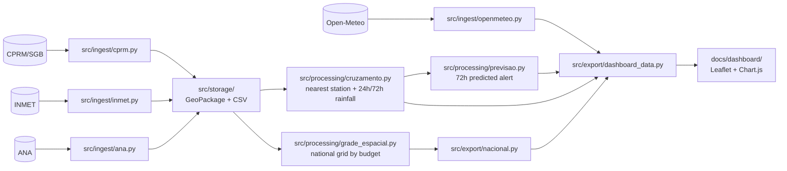

<div align="center">

<picture>
  <source media="(prefers-color-scheme: dark)" srcset="docs/logo/orca-logo-escuro.png">
  <source media="(prefers-color-scheme: light)" srcset="docs/logo/orca-logo-claro.png">
  
</picture>

# ORCA
*Open Risk and Catastrophe Aggregator*

**Brazil's official geological risk sectors (CPRM/SGB) cross-referenced with recent rainfall, in a static dashboard.**

[](https://github.com/hcristosm/ORCA/releases/latest)
[](#installation)
[](https://hcristosm.github.io/ORCA/)
[](.github/workflows/ci.yml)
[](LICENSE)

*[Leia em português](README.md)*

</div>

---

## About

ORCA downloads the geological risk sectorization published by CPRM/SGB
(Brazil's geological survey), cross-references each sector with publicly
available recent rainfall, and shows on a map which sectors are above a
threshold you choose.

The idea came from a concrete problem: as a geologist who's mapped risk areas
in the field, I wanted to see risk data and rainfall data side by side without
needing a backend, a server, or any cost. Both datasets are public, but they
almost never show up together.

**Live dashboard:** [hcristosm.github.io/ORCA/](https://hcristosm.github.io/ORCA/),
published on GitHub Pages and refreshed daily by cron.

<p align="center">
  
  
</p>

## What the project does today

- Covers all **27 Brazilian states**, with a state selector on the dashboard.
- Downloads CPRM/SGB risk sectors incrementally and stores them in
  GeoPackage.
- Fetches hourly rainfall from **Open-Meteo** (default source, queried at
  each sector's centroid) or cross-references against the nearest **INMET**
  or **ANA** station.
- Computes 24h and 72h accumulated rainfall and a predicted 72h alert
  trajectory.
- Exports everything as static GeoJSON/JSON and serves a dashboard in plain
  HTML, CSS and JS, with a map (Leaflet), table, counters and chart
  (Chart.js). Risk degree is shown as hachure patterns, in the style of a
  geological map, so color stays reserved for one thing only: a sector above
  the threshold. A ruler at the top plots every sector against the
  threshold, which you can drag.
- Lets visitors upload their own area (GeoJSON, KML, or a zipped shapefile)
  and see rainfall calculated for it, entirely in the browser, without
  uploading the file anywhere.
- Runs two separate workflows: sectors once a month, rainfall once a day.
- 174 tests with mocked HTTP, running in CI on every push.

## Data sources

| Source | What it provides | Endpoint |
|---|---|---|
| [CPRM/SGB](https://www.sgb.gov.br/) | Risk sectorization polygons (degree, typology, affected households and people) | `geoportal.sgb.gov.br/.../risco/FeatureServer/0` (ArcGIS REST) |
| [Open-Meteo](https://open-meteo.com/) | Hourly rainfall by coordinate, no station needed. Dashboard's default source | `api.open-meteo.com/v1/forecast` |
| [INMET](https://portal.inmet.gov.br/) | Hourly rainfall by automatic weather station | `portal.inmet.gov.br/uploads/dadoshistoricos/{ano}.zip` |
| [ANA](https://www.gov.br/ana/pt-br) | Rainfall every 15min by telemetry station, complementary to INMET | `telemetriaws1.ana.gov.br/ServiceANA.asmx` (SOAP) |

CPRM was renamed to SGB. The old domains (`geoportal.cprm.gov.br` and
similar) still respond partially, but the risk layer now lives at
`geoportal.sgb.gov.br`.

The map's municipality choropleth uses IBGE's mesh, fetched live by the
browser. It's the only IBGE dependency left, and it lives only in the
front-end. If IBGE goes down, the map degrades for the viewer but the
pipeline doesn't notice.

## Architecture



`src/cli.py` gathers the commands. `src/storage/` is a thin layer over
GeoPackage (sectors) and CSV (rainfall), no database.
`src/storage_cache_openmeteo.py` keeps a SQLite history of what's already
been downloaded from Open-Meteo, so it doesn't re-fetch hours it already
has.

The dashboard used to be a Streamlit app. It became a static site because
that gives full control over layout and aesthetics, lets it be published as
a page, and drops the need for a running Python process.

## Installation

Requires Python 3.11+.

```bash
git clone https://github.com/hcristosm/ORCA
cd ORCA
python3 -m venv .venv
source .venv/bin/activate
pip install -e ".[dev]"
```

## Usage

### Download the risk sectors

```bash
python -m src.cli ingest-cprm --uf SP         # one state -> data/risco_sp.gpkg
python -m src.cli ingerir-setores             # all 27 states
```

### Export the dashboard data

```bash
python -m src.cli exportar-dashboard --uf SP
# -> docs/dashboard/data/setores_sp.geojson, series_sp.json, meta_sp.json, previsao_sp.json
```

By default it uses Open-Meteo, which only needs the sectors. To use
nearest-station cross-referencing, pass `--fonte inmet` (which requires
running `ingest-inmet --uf SP --ano 2026` and, optionally,
`ingest-ana --uf SP` first).

For all states at once:

```bash
python -m src.cli atualizar-nacional --ufs SP,RJ,MG   # no --ufs = all 27
```

This command computes a single national spatial grid before exporting, so
that nearby sectors (even across neighboring states) share the same query
point. This keeps the total point count within `--orcamento-alvo` (default
6,000; Open-Meteo's free tier cap is 10,000/day). It doesn't ingest
anything: it expects the GeoPackages to already be in `data/`.

### Open the dashboard

```bash
scripts/rodar_dashboard.sh    # shortcut for python -m http.server 8000 --directory docs
# then open http://localhost:8000/dashboard/
```

Needs to be served over HTTP because the browser's `fetch()` doesn't read
`file://`.

## How it runs in production

Risk sectors change on a scale of months. Rainfall changes on a scale of
hours. That's why there are two workflows:

- **Monthly** ([`ingerir-setores.yml`](.github/workflows/ingerir-setores.yml)):
  downloads sectors for all 27 states and publishes the GeoPackages to the
  `dados-base` branch. It's the only part of the project that talks to SGB.
  Generous timeouts (120s, 5 retries) and no cache fallback: if SGB goes
  down, the run fails loudly instead of closing green with empty data.
- **Daily** ([`atualizar-dados.yml`](.github/workflows/atualizar-dados.yml),
  `0 9 * * *`): reads the sectors from `dados-base`, runs
  `atualizar-nacional`, and publishes to `gh-pages`. Doesn't touch any
  `.gov.br` source.

If SGB goes down, the dashboard stays up with the sectors from `dados-base`.

Publishing is non-destructive: before pushing, the job fetches the current
`gh-pages` and preserves the data for any state this run didn't regenerate
([`scripts/mesclar_publicado.py`](scripts/mesclar_publicado.py)). A state
that failed doesn't disappear from the dashboard, it just goes stale. Three
guards protect this merge, and every rejection fails the run:

- rejects if the run exported zero states;
- rejects if new coverage falls below a floor (default 60%, adjustable via
  `ORCA_PISO_COBERTURA`). That 0.6 came from the 12 clean runs between
  2026-08-10 and 2026-08-23, where coverage ranged from 70% to 100%: it sits
  below the worst normal case while still blocking the real degenerate cases
  (4% and 7%);
- rejects an empty set, an unreadable published count, or a regression in
  total states versus what's already live.

These guards exist because on 2026-08-22 and 2026-08-23 two runs published 1
and 2 states out of 27 while closing as `success`, with CPRM ingestion
failing on timeout.

## Known limitations

- **INMET's rainfall data lags by days.** The annual package isn't updated
  minute by minute. The dashboard always shows the data's reference date.
- **INMET ingestion is incremental, not date-filtered on the server.** INMET
  only offers the whole annual ZIP. From the second run on, the download is
  skipped if the ZIP hasn't changed, and reprocessing skips any station with
  no change via CRC32, merging the last 7 days of the ones that did change.
  Corrections outside that window aren't recaptured.
- **Station density is low.** SP has 40 automatic INMET stations for 904
  sectors, with an average distance of about 26km. Highly localized
  convective rainfall can slip through.
- **The attention threshold (default 100mm/72h) is illustrative.** It's a
  common reference in landslide literature, not an official value calibrated
  for CPRM/SGB sectors. The dashboard flags this and lets you adjust the
  value.
- **National coverage only uses Open-Meteo.** Running INMET/ANA across all
  27 states would require ingesting source by source, state by state. Not
  automated.
- **Publishing to `gh-pages` isn't reversible yet.** The deploy uses
  `force_orphan: true`, so the branch has a single commit. That's because of
  the Open-Meteo cache blob (~45MB) that changes daily. Getting the cache
  out of there is a prerequisite for dropping `force_orphan`. Until then the
  protection is preventive, not reversible.
- **No staleness badge and no post-deploy smoke test.** The dashboard shows
  when it was generated, but doesn't highlight when the data crosses a
  cycle, and nothing checks after deploy whether the public URL actually
  serves all 27 states.
- **Open-Meteo rate-limits by volume, not just frequency.** Tested with a
  real request: a single POST with SP's ~900 coordinates works fine, but
  repeating that volume consistently triggers `429`.
  `src/ingest/openmeteo.py` batches in groups of 50 points, uses a short
  history window, and waits 60s on `429`.
- **No authentication and no multi-user support.** It's a local, portfolio
  tool.
- **The dashboard doesn't update on demand.** It shows the last export,
  which runs once a day. To see fresher data right away, run
  `exportar-dashboard` locally.

## Tests

```bash
pytest
```

174 tests covering ingestion (ArcGIS REST, pagination, incremental
watermark, retry and fallback), INMET CSV and ANA XML parsing, Open-Meteo
batching and retry, SQLite cache, national spatial grid, spatial and
temporal cross-referencing, forecasting, export for both sources, and the
non-destructive merge with `gh-pages`. Every network call is mocked, so the
suite runs without internet.

The dashboard itself (HTML and JS) has no automated tests, validation is
manual.

## Decisions and investigations

The bigger decisions were tested with real requests, not assumed:

- **CEMADEN vs. INMET:** CEMADEN requires a captcha and the layers without a
  captcha are mirrors from 2017/2019. INMET's dynamic API sits behind a WAF.
  That left the annual package.
- **ANA as a complementary source:** of the 437 stations listed for SP, 271
  (62%) have live data, with a median distance of 18.6km to the nearest
  sector. The caveat is that most are hydroelectric or fluviometric
  stations, not dedicated rain gauges.
- **Streamlit for a static site:** solved aesthetics, layout and
  distribution.
- **Open-Meteo as the default:** answers rainfall by coordinate, without
  depending on a station or INMET's lag.
- **National coverage:** incremental CPRM ingestion plus a spatial grid
  calibrated by binary search, instead of a hand-picked density threshold.

## Roadmap

- Get the Open-Meteo cache out of `gh-pages` to drop `force_orphan` and
  recover the published branch's history.
- Staleness badge on the dashboard and a smoke test against the public URL
  after deploy.
- Municipal fallback: city-level layers on ArcGIS REST. Investigated for
  Itaquaquecetuba/SP on 2026-08-14, no confirmed public endpoint. Pending a
  pilot municipality with open data.
- Better orchestration of Open-Meteo requests: pagination, more complete
  backoff, and maybe a queue to space out requests.

## How this was built

I'm a geologist, not a developer by training. ORCA was largely built by
vibe coding with Claude Code: I bring the problem, the domain knowledge and
the decisions, and Claude writes most of the code. I review, test, and
correct course when the result doesn't match the reality of the data.

I figured it's better to be upfront about this than to pretend otherwise.
If you find something odd in the code, that's probably why, and an issue is
welcome.

## Contributing

Issues, PRs and suggestions are welcome. See the
[contributing guide](CONTRIBUTING.md) and the
[Code of Conduct](CODE_OF_CONDUCT.md).

## License

[BSD 3-Clause](LICENSE): free use, copying, modification and
redistribution, commercial included, as long as the copyright notice and
license are kept and credit to the original author (Mateus Hcristos
Leptokarydis) is preserved.

The public data belongs to their respective agencies:
[CPRM/SGB](https://www.sgb.gov.br/), [INMET](https://portal.inmet.gov.br/),
[ANA](https://www.gov.br/ana/pt-br) and [Open-Meteo](https://open-meteo.com/).
Check each one's terms of use before redistributing.
