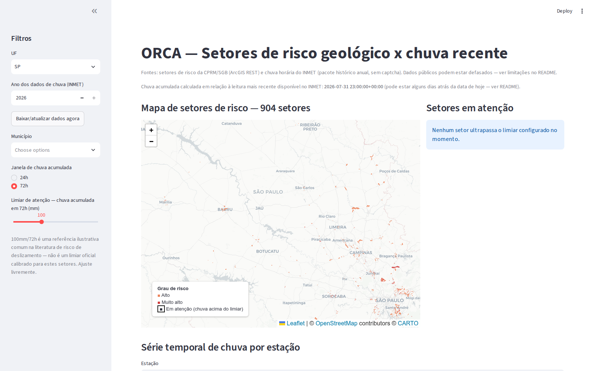
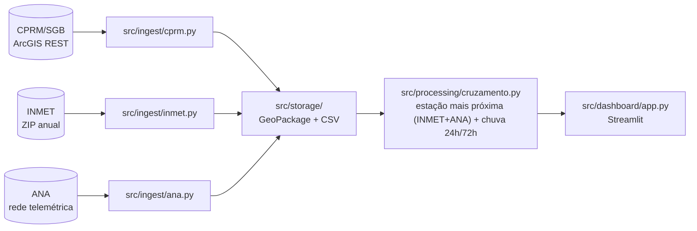
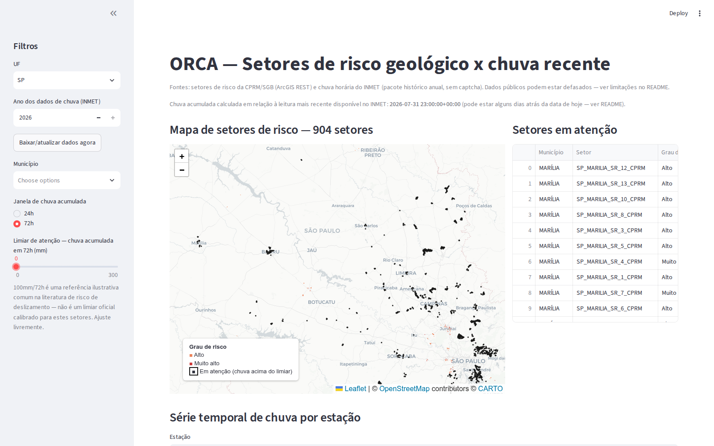
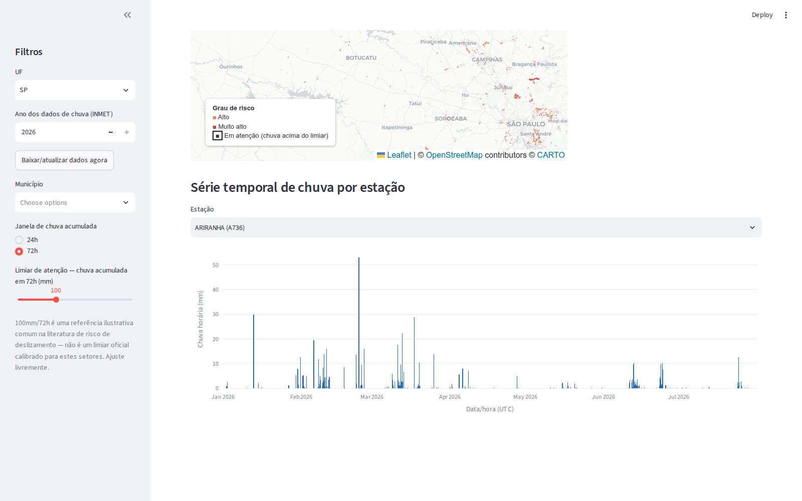

<div align="center">

# ORCA
*open source risk and catastrophe aggregator*

**Setores de risco geológico da CPRM/SGB cruzados com chuva recente do INMET, num dashboard local.**

[](#instalação)
[](#rodando-o-dashboard)
[](.github/workflows/ci.yml)
[](#licença)

</div>

---

## Sobre

ORCA baixa a setorização de risco geológico publicada pela **CPRM/SGB** (Serviço
Geológico do Brasil), cruza cada setor com a **chuva horária mais recente
disponível publicamente** e sinaliza, num mapa interativo, quais setores estão
com chuva acumulada acima de um limiar configurável.

Nasceu de um problema concreto. Como geólogo que já mapeou áreas de risco pelo
Ministério das Cidades (PMRR de Itaquaquecetuba/SP) e que hoje trabalha com
visão computacional para monitoramento de encostas, eu queria uma ferramenta
local, sem backend, sem custo, que juntasse duas fontes públicas que raramente
aparecem lado a lado.

<p align="center">
  
</p>

---

## Sumário

- [Fontes de dados](#fontes-de-dados)
- [Arquitetura](#arquitetura)
- [Instalação](#instalação)
- [Uso](#uso)
  - [1. Baixar os setores de risco (CPRM/SGB)](#1-baixar-os-setores-de-risco-cprmsgb)
  - [2. Baixar a chuva (INMET)](#2-baixar-a-chuva-inmet)
  - [3. Rodar o dashboard](#3-rodando-o-dashboard)
  - [4. Atualização automática](#4-atualização-automática)
- [Limitações conhecidas](#limitações-conhecidas)
- [Testes e CI](#testes-e-ci)
- [Decisões e investigações](#decisões-e-investigações)
- [Roadmap](#roadmap)
- [Licença](#licença)

---

## Fontes de dados

| Fonte | O que fornece | Endpoint confirmado em 05/08/2026 |
|---|---|---|
| **CPRM/SGB** | Polígonos de setorização de risco geológico (grau de risco, tipologia, nº de moradias/pessoas afetadas) | `https://geoportal.sgb.gov.br/server/rest/services/gestaoterritorial/risco/FeatureServer/0` (ArcGIS REST, GeoJSON) |
| **INMET** | Chuva horária por estação meteorológica automática | `https://portal.inmet.gov.br/uploads/dadoshistoricos/{ano}.zip` (CSV, pacote público anual) |
| **ANA** | Chuva em intervalos de 15min por estação telemétrica (fonte complementar ao INMET; nem toda estação tem dado vivo — ver [Decisões e investigações](#decisões-e-investigações)) | `https://telemetriaws1.ana.gov.br/ServiceANA.asmx` (SOAP/XML, sem captcha/autenticação) |

A CPRM foi renomeada para **SGB**. Os domínios do enunciado original
(`geoportal.cprm.gov.br`, `sace.cprm.gov.br`, `arcgisserver.cprm.gov.br`) ainda
respondem parcialmente, mas a camada de setorização de risco hoje mora em
`geoportal.sgb.gov.br`, sob o certificado TLS de `geoportal.sgb.gov.br`.

## Arquitetura



`src/cli.py` expõe os comandos de ingestão (`ingest-cprm`, `ingest-inmet`,
`atualizar`) usados manualmente ou pelo cron diário
([`atualizar-dados.yml`](.github/workflows/atualizar-dados.yml)). `tests/`
cobre cada módulo com HTTP mockado, sem depender de rede.

A camada `src/storage/` do plano original chegou a ficar de fora (SQLite/DuckDB
pareciam desnecessários para o volume de dados de um estado). Hoje ela existe
como uma camada fina sobre GeoPackage (setores) e CSV (chuva), usada por
`ingest` e pelo dashboard, sem introduzir dependência de banco.

## Instalação

Requer Python 3.11+.

```bash
git clone <este-repositório>
cd ORCA
python3 -m venv .venv
source .venv/bin/activate
pip install -e ".[dev]"
```

## Uso

### 1. Baixar os setores de risco (CPRM/SGB)

```bash
python -m src.cli ingest-cprm --uf SP
# -> data/risco_sp.gpkg
```

Qualquer UF do Brasil funciona (a camada é nacional). O projeto começou por SP
mas generaliza sem mudar código.

### 2. Baixar a chuva (INMET)

```bash
python -m src.cli ingest-inmet --uf SP --ano 2026
# -> data/chuva_sp_2026.csv
```

O primeiro download baixa o ZIP anual completo do Brasil (~55MB) e mantém em
cache local (`data/inmet_<ano>.zip`); downloads seguintes para outras UFs do
mesmo ano reaproveitam o cache.

### 3. Rodando o dashboard

```bash
streamlit run src/dashboard/app.py
```

Se os dados ainda não existirem localmente, a barra lateral tem um botão
**"Baixar/atualizar dados agora"**. O dashboard mostra o mapa de setores
coloridos por grau de risco, um painel de setores em atenção (chuva acumulada
acima do limiar escolhido) e a série temporal de chuva por estação. Filtros de
UF, município, janela de acumulado (24h/72h) e limiar de atenção ficam na
barra lateral.

Um checkbox **"Verificar novos dados automaticamente"** faz o dashboard checar
em segundo plano, num intervalo configurável de 1 a 30 minutos, se os arquivos
locais foram atualizados por outro processo (cron diário ou `orca atualizar`
manual) e recarregar sozinho — sem baixar dados novos por conta própria.

<p align="center">
  
</p>

<p align="center">
  
</p>

### 4. Atualização automática

```bash
python scripts/atualizar_dados.py --uf SP --ano 2026
```

Roda as duas ingestões em sequência, tolera a falha de uma fonte sem derrubar
a outra e grava `data/ultima_atualizacao.txt` (também exibido na barra
lateral do dashboard). É o mesmo script que
[`atualizar-dados.yml`](.github/workflows/atualizar-dados.yml) roda todo dia
(cron `0 9 * * *`, mais `workflow_dispatch` manual), publicando os dados como
artefato do GitHub Actions.

## Limitações conhecidas

- **A chuva do INMET tem alguns dias de defasagem.** O pacote histórico anual
  não é atualizado minuto a minuto; a "chuva acumulada" mostrada no dashboard
  é sempre relativa à leitura mais recente **disponível**, não necessariamente
  a "agora". O próprio dashboard mostra essa data de referência.
- **Densidade de estações é baixa.** SP tem 40 estações automáticas do INMET
  para 904 setores de risco; a distância média até a estação mais próxima
  fica em torno de 26km (máximo observado: ~74km). Chuva muito localizada
  (comum em eventos convectivos) pode não ser capturada pela estação mais
  próxima de um setor específico.
- **O limiar de atenção (padrão 100mm/72h) é ilustrativo.** É uma referência
  comum na literatura de risco de deslizamento, não um valor oficial calibrado
  para os setores da CPRM/SGB. O próprio dashboard avisa isso e deixa o valor
  livremente ajustável.
- **Cobertura nacional é parcial por design.** O MVP cobre SP; a arquitetura
  já generaliza para qualquer UF (ambos os clientes aceitam `--uf`), mas
  cobrir o Brasil inteiro de uma vez não fazia parte do escopo desta fase.
- **Sem autenticação/multiusuário.** É uma ferramenta local de portfólio, não
  um serviço multiusuário.

## Testes e CI

```bash
pytest
```

36 testes cobrindo: parsing de resposta ArcGIS REST (CPRM/SGB), paginação,
retry com backoff e fallback para cache local; parsing do CSV do INMET e
leitura de estação dentro do ZIP anual; parsing do XML/SOAP da ANA, retry em
HTTP 429 e o filtro de estações sem dado recente; a lógica de cruzamento
espacial (estação mais próxima, incluindo o pareamento combinado INMET+ANA
com desempate por recência) e temporal (chuva acumulada 24h/72h); e as
funções auxiliares do dashboard. Toda chamada de rede é mockada, então a
suíte roda sem internet.

O workflow [`ci.yml`](.github/workflows/ci.yml) roda essa suíte a cada push e
pull request, separado do cron diário de atualização de dados.

## Decisões e investigações

Duas decisões técnicas importantes já foram investigadas com requisições
reais, não por suposição — histórico completo em
[`docs/investigacoes.md`](docs/investigacoes.md).

**CEMADEN → INMET.** O plano original previa usar o CEMADEN como fonte de
chuva, mas o download exige captcha e as únicas camadas sem captcha são
espelhos estáticos de 2017/2019. A alternativa (API dinâmica do INMET) está
atrás de um WAF que bloqueia clientes não navegador. A solução viável foi o
pacote histórico anual do INMET, usado hoje pelo ORCA. →
[detalhes completos](docs/investigacoes.md#cemaden--inmet-por-que-a-fonte-de-chuva-mudou)

**Investigação da ANA → integração feita.** A rede telemétrica da ANA foi
avaliada como fonte complementar de chuva em tempo real: das 437 estações
listadas para SP, 271 (62%) têm dado vivo, com distância mediana de 18,6km
até o setor de risco mais próximo — cobertura mais densa que o INMET.
Ressalva: as estações com dado vivo são majoritariamente
hidrelétricas/fluviométricas, não pluviômetros dedicados. A integração foi
implementada em `src/ingest/ana.py`: o cruzamento (`calcular_cruzamento`)
agora usa a estação mais próxima entre INMET e ANA combinadas — distância
manda, com desempate por recência de leitura quando as duas fontes têm uma
estação a menos de 500m de diferença de distância. →
[detalhes completos](docs/investigacoes.md#investigação-fontes-de-chuva-em-tempo-real)

## Roadmap

- ~~Levantar quais estações da rede telemétrica da ANA têm dado vivo de chuva
  em SP e integrar como fonte complementar ao INMET~~ — levantamento feito em
  08/08/2026, integração (`src/ingest/ana.py` + cruzamento combinado)
  implementada em 09/08/2026 (ver
  [Decisões e investigações](#decisões-e-investigações)).
- Fallback municipal: camadas próprias de prefeituras em ArcGIS REST, sem
  reescrever o pipeline de ingestão.
- Cobrir mais UFs além de SP.
- Persistir o histórico de chuva incrementalmente (hoje cada ingestão baixa o
  ano inteiro de novo).

## Licença

Projeto de portfólio pessoal. Os dados públicos usados pertencem à CPRM/SGB e
ao INMET; consulte os termos de uso de cada órgão antes de redistribuir.
