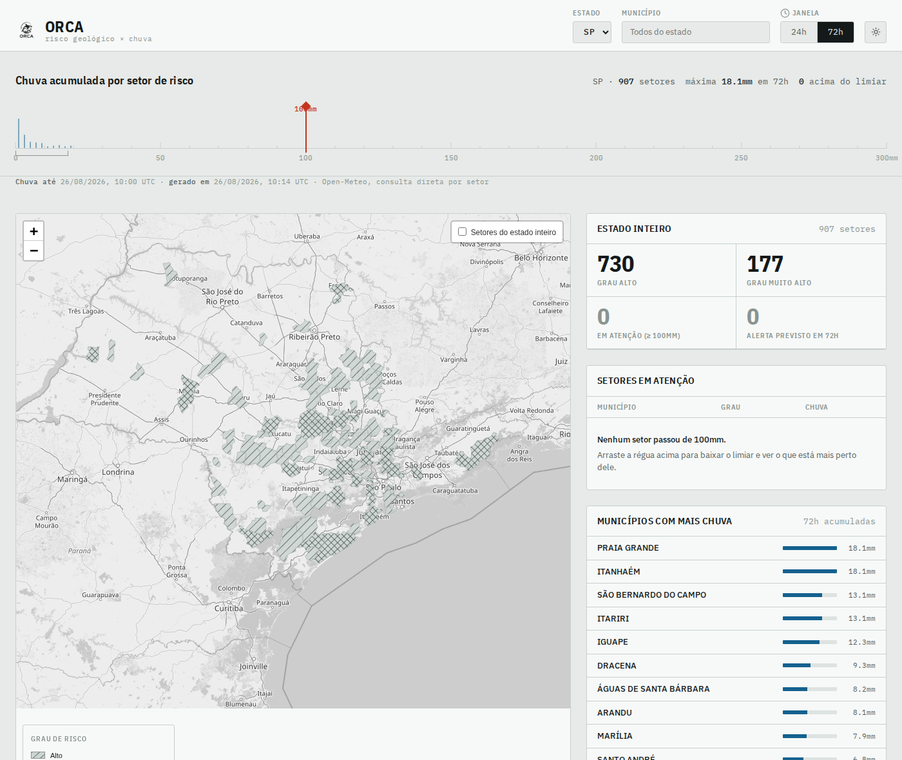
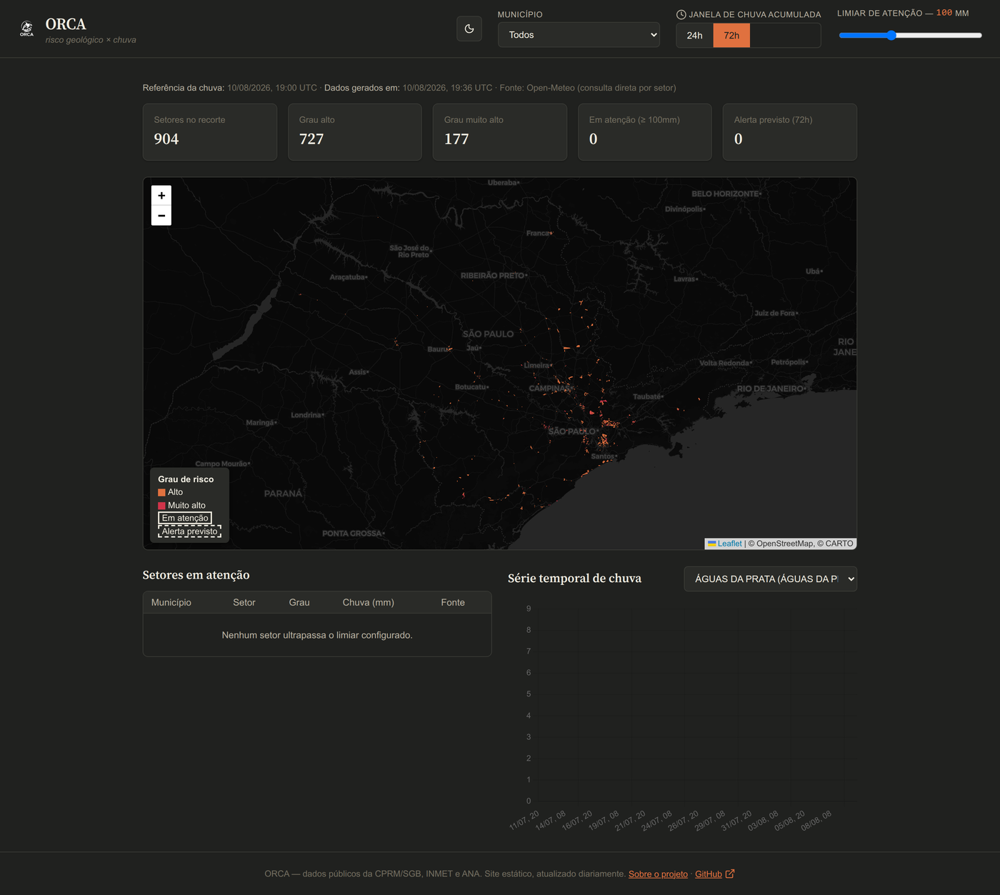
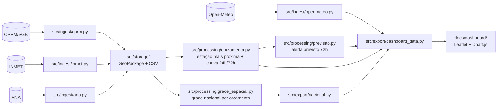

<div align="center">

<picture>
  <source media="(prefers-color-scheme: dark)" srcset="docs/logo/orca-logo-escuro.png">
  <source media="(prefers-color-scheme: light)" srcset="docs/logo/orca-logo-claro.png">
  
</picture>

# ORCA
*Open Risk and Catastrophe Aggregator*

**Setores de risco geológico da CPRM/SGB cruzados com chuva recente, num dashboard estático.**

[](https://github.com/hcristosm/ORCA/releases/latest)
[](#instalação)
[](https://hcristosm.github.io/ORCA/dashboard/)
[](.github/workflows/ci.yml)
[](LICENSE)

</div>

---

## Sobre

O ORCA baixa a setorização de risco geológico publicada pela CPRM/SGB, cruza
cada setor com a chuva recente disponível publicamente e mostra num mapa quais
setores estão com acumulado acima de um limiar que você escolhe.

A ideia veio de um problema concreto: como geólogo que já mapeou área de risco,
eu queria ver o dado de risco e o dado de chuva lado a lado sem precisar de
backend, de servidor e de custo. As duas informações são públicas, mas quase
nunca aparecem juntas.

**Dashboard ao vivo:** [hcristosm.github.io/ORCA/](https://hcristosm.github.io/ORCA/),
publicado no GitHub Pages e atualizado todo dia por cron.

<p align="center">
  
  
</p>

## O que o projeto faz hoje

- Cobre as **27 UFs**, com seletor de estado no dashboard.
- Baixa os setores de risco da CPRM/SGB de forma incremental e guarda em
  GeoPackage.
- Busca chuva horária na **Open-Meteo** (fonte padrão, consulta o centro de cada
  setor) ou cruza com a estação mais próxima do **INMET** e da **ANA**.
- Calcula acumulado de 24h e 72h e uma trajetória de alerta previsto para as
  próximas 72h.
- Exporta tudo como GeoJSON/JSON estático e serve um dashboard em HTML, CSS e JS
  puro, com mapa (Leaflet), tabela, cards e gráfico (Chart.js).
- Deixa o visitante subir uma área própria (GeoJSON, KML ou shapefile em `.zip`)
  e ver a chuva calculada pra ela, tudo dentro do navegador, sem enviar o arquivo
  pra lugar nenhum.
- Roda dois workflows separados: setores uma vez por mês, chuva uma vez por dia.
- 174 testes com HTTP mockado, rodando no CI a cada push.

## Fontes de dados

| Fonte | O que fornece | Endpoint |
|---|---|---|
| [CPRM/SGB](https://www.sgb.gov.br/) | Polígonos de setorização de risco (grau, tipologia, moradias e pessoas afetadas) | `geoportal.sgb.gov.br/.../risco/FeatureServer/0` (ArcGIS REST) |
| [Open-Meteo](https://open-meteo.com/) | Chuva horária por coordenada, sem estação. Fonte padrão do dashboard | `api.open-meteo.com/v1/forecast` |
| [INMET](https://portal.inmet.gov.br/) | Chuva horária por estação automática | `portal.inmet.gov.br/uploads/dadoshistoricos/{ano}.zip` |
| [ANA](https://www.gov.br/ana/pt-br) | Chuva a cada 15min por estação telemétrica, complementar ao INMET | `telemetriaws1.ana.gov.br/ServiceANA.asmx` (SOAP) |

A CPRM virou SGB. Os domínios antigos (`geoportal.cprm.gov.br` e companhia)
ainda respondem em parte, mas a camada de risco hoje mora em
`geoportal.sgb.gov.br`.

O choropleth de municípios do mapa usa a malha do IBGE, buscada ao vivo pelo
navegador. É a única dependência de IBGE que sobrou, e ela vive só no front-end.
Se o IBGE cair, o mapa degrada pra quem está olhando e o pipeline nem percebe.

## Arquitetura



`src/cli.py` reúne os comandos. `src/storage/` é uma camada fina sobre
GeoPackage (setores) e CSV (chuva), sem banco de dados.
`src/storage_cache_openmeteo.py` guarda o histórico já baixado da Open-Meteo num
SQLite, pra não repedir hora que já foi buscada.

O dashboard já foi um app Streamlit. Virou site estático porque assim dá pra
controlar layout e estética, publicar como página e não depender de processo
Python rodando.

## Instalação

Requer Python 3.11+.

```bash
git clone https://github.com/hcristosm/ORCA
cd ORCA
python3 -m venv .venv
source .venv/bin/activate
pip install -e ".[dev]"
```

## Uso

### Baixar os setores de risco

```bash
python -m src.cli ingest-cprm --uf SP         # uma UF -> data/risco_sp.gpkg
python -m src.cli ingerir-setores             # todas as 27 UFs
```

### Exportar os dados do dashboard

```bash
python -m src.cli exportar-dashboard --uf SP
# -> docs/dashboard/data/setores_sp.geojson, series_sp.json, meta_sp.json, previsao_sp.json
```

Por padrão usa a Open-Meteo, que só precisa dos setores. Pra usar o cruzamento
por estação mais próxima, passe `--fonte inmet` (aí precisa rodar
`ingest-inmet --uf SP --ano 2026` e, se quiser, `ingest-ana --uf SP` antes).

Pra todas as UFs de uma vez:

```bash
python -m src.cli atualizar-nacional --ufs SP,RJ,MG   # sem --ufs = as 27
```

Esse comando calcula uma grade espacial nacional única antes de exportar, de
modo que setores próximos (mesmo em UFs vizinhas) compartilhem o mesmo ponto de
consulta. Isso mantém o total de pontos dentro de `--orcamento-alvo` (padrão
6.000; o teto gratuito da Open-Meteo é 10.000/dia). Ele não ingere nada: espera
os GeoPackages já em `data/`.

### Abrir o dashboard

```bash
scripts/rodar_dashboard.sh    # atalho pra python -m http.server 8000 --directory docs
# depois abra http://localhost:8000/dashboard/
```

Precisa servir por HTTP porque o `fetch()` do navegador não lê `file://`.

## Como roda em produção

Setor de risco muda em escala de meses. Chuva muda em escala de horas. Por isso
são dois workflows:

- **Mensal** ([`ingerir-setores.yml`](.github/workflows/ingerir-setores.yml)):
  baixa os setores das 27 UFs e publica os GeoPackages na branch `dados-base`.
  É o único ponto do projeto que fala com a SGB. Timeouts generosos (120s, 5
  tentativas) e sem fallback de cache: se a SGB cair, o run falha alto em vez de
  fechar verde com dado vazio.
- **Diário** ([`atualizar-dados.yml`](.github/workflows/atualizar-dados.yml),
  `0 9 * * *`): lê os setores da `dados-base`, roda `atualizar-nacional` e
  publica no `gh-pages`. Não toca em nenhuma fonte `.gov.br`.

Se a SGB cair, o dashboard continua no ar com os setores da `dados-base`.

A publicação é não-destrutiva: antes de subir, o job busca o `gh-pages` atual e
preserva os dados das UFs que este run não regenerou
([`scripts/mesclar_publicado.py`](scripts/mesclar_publicado.py)). UF que falhou
não some do dashboard, ela envelhece. Três guardas protegem essa mescla, e toda
recusa falha o run:

- recusa se o run não exportou UF nenhuma;
- recusa se a cobertura nova ficar abaixo de um piso (padrão 60%, ajustável por
  `ORCA_PISO_COBERTURA`). Esse 0,6 saiu dos 12 runs limpos entre 10 e
  23/08/2026, em que a cobertura oscilou entre 70% e 100%: fica abaixo do pior
  caso normal e ainda barra os casos degenerados reais (4% e 7%);
- recusa conjunto vazio, contagem publicada ilegível, ou regressão no total de
  UFs em relação ao que já está no ar.

Essas guardas existem porque em 22 e 23/08/2026 dois runs publicaram 1 e 2 UFs
de 27 fechando como `success`, com a ingestão da CPRM falhando por timeout.

## Limitações conhecidas

- **A chuva do INMET tem dias de defasagem.** O pacote anual não é atualizado
  minuto a minuto. O dashboard sempre mostra a data de referência do dado.
- **A ingestão do INMET é incremental, não por data no servidor.** O INMET só
  oferece o ZIP anual inteiro. A partir da segunda execução o download pula se o
  ZIP não mudou, e o reprocessamento pula estação sem mudança via CRC32,
  mesclando os últimos 7 dias das que mudaram. Retificação fora dessa janela não
  é recapturada.
- **Densidade de estação é baixa.** SP tem 40 estações automáticas do INMET para
  904 setores, com distância média de uns 26km. Chuva convectiva bem localizada
  pode passar batido.
- **O limiar de atenção (padrão 100mm/72h) é ilustrativo.** É referência comum
  na literatura de deslizamento, não um valor oficial calibrado pros setores da
  CPRM/SGB. O dashboard avisa isso e deixa o valor ajustável.
- **A cobertura nacional só usa Open-Meteo.** Rodar INMET/ANA nas 27 UFs exigiria
  ingerir fonte por fonte, UF por UF. Não é automatizado.
- **A publicação no `gh-pages` ainda não é reversível.** O deploy usa
  `force_orphan: true`, então a branch tem um commit só. Isso existe por causa do
  blob de cache da Open-Meteo (~45MB) que muda todo dia. Tirar o cache de lá é
  pré-requisito pra abandonar o `force_orphan`. Até então a proteção é
  preventiva, não reversível.
- **Falta selo de defasagem e teste de fumaça pós-deploy.** O dashboard mostra
  quando foi gerado, mas sem realce quando o dado passa de um ciclo, e nada
  confere depois do deploy se a URL pública serve mesmo as 27 UFs.
- **A Open-Meteo limita por volume, não só por frequência.** Testado com
  requisição real: um POST com as ~900 coordenadas de SP funciona sozinho, mas
  repetir esse volume gera `429` de forma consistente.
  `src/ingest/openmeteo.py` divide em lotes de 50 pontos, usa janela de histórico
  curta e espera 60s em `429`.
- **Sem autenticação e sem multiusuário.** É ferramenta local e de portfólio.
- **O dashboard não atualiza sob demanda.** Ele mostra a última exportação, que
  roda uma vez por dia. Pra ver dado mais novo na hora, rode
  `exportar-dashboard` localmente.

## Testes

```bash
pytest
```

174 testes cobrindo ingestão (ArcGIS REST, paginação, incremental por marcador
d'água, retry e fallback), parsing do CSV do INMET e do XML da ANA, lotes e
retry da Open-Meteo, cache SQLite, grade espacial nacional, cruzamento espacial e
temporal, previsão, exportação nas duas fontes e a mescla não-destrutiva com o
`gh-pages`. Toda chamada de rede é mockada, então a suíte roda sem internet.

O dashboard em si (HTML e JS) não tem teste automatizado, a validação é manual.

## Decisões e investigações

As decisões maiores foram testadas com requisição real, não por suposição:

- **CEMADEN para INMET:** o CEMADEN exige captcha e as camadas sem captcha são
  espelhos de 2017/2019. A API dinâmica do INMET está atrás de um WAF. Sobrou o
  pacote anual.
- **ANA como fonte complementar:** das 437 estações listadas pra SP, 271 (62%)
  têm dado vivo, com distância mediana de 18,6km até o setor mais próximo. A
  ressalva é que a maioria é hidrelétrica ou fluviométrica, não pluviômetro
  dedicado.
- **Streamlit para site estático:** resolveu estética, layout e distribuição.
- **Open-Meteo como padrão:** responde chuva por coordenada, sem depender de
  estação nem de defasagem do INMET.
- **Cobertura nacional:** ingestão incremental da CPRM mais uma grade espacial
  calibrada por busca binária, em vez de limiar de densidade escolhido a dedo.

## Roadmap

- Tirar o cache da Open-Meteo do `gh-pages` pra abandonar o `force_orphan` e
  recuperar o histórico da branch publicada.
- Selo de defasagem no dashboard e teste de fumaça contra a URL pública depois
  do deploy.
- Fallback municipal: camadas de prefeituras em ArcGIS REST. Investigado pra
  Itaquaquecetuba/SP em 14/08/2026, sem endpoint público confirmado. Pendente de
  um município piloto com dado aberto.
- Orquestração melhor das requisições à Open-Meteo: paginação, backoff mais
  completo e talvez uma fila pra espaçar o envio.

## Sobre como isso foi feito

Sou geólogo, não desenvolvedor de formação. O ORCA foi construído em boa parte
por vibe coding com o Claude Code: eu trago o problema, o conhecimento do
domínio e as decisões, e o Claude escreve a maior parte do código. Reviso,
testo e corrijo o rumo quando o resultado não bate com a realidade do dado.

Achei melhor deixar isso claro do que fingir o contrário. Se você encontrar
algo estranho no código, provavelmente é isso, e um issue é bem-vindo.

## Contribuindo

Issues, PRs e sugestões são bem-vindos. Veja o
[guia de contribuição](CONTRIBUTING.md) e o
[Código de Conduta](CODE_OF_CONDUCT.md).

## Licença

[BSD 3-Clause](LICENSE): uso, cópia, modificação e redistribuição livres,
inclusive comerciais, desde que o aviso de copyright e a licença sejam mantidos
e o crédito ao autor original (Mateus Hcristos Leptokarydis) preservado.

Os dados públicos pertencem aos seus órgãos:
[CPRM/SGB](https://www.sgb.gov.br/), [INMET](https://portal.inmet.gov.br/),
[ANA](https://www.gov.br/ana/pt-br) e [Open-Meteo](https://open-meteo.com/).
Consulte os termos de uso de cada um antes de redistribuir.
