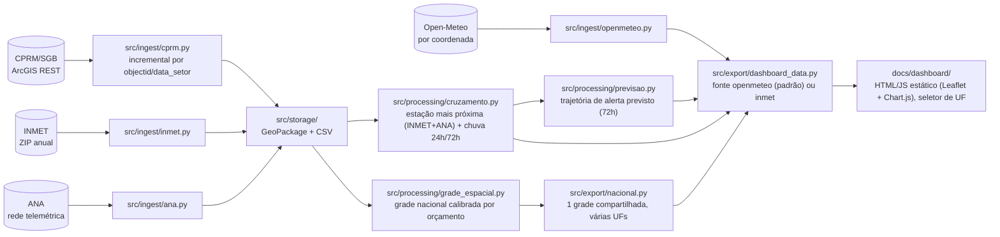

<div align="center">

<picture>
  <source media="(prefers-color-scheme: dark)" srcset="docs/logo/orca-logo-escuro.png">
  <source media="(prefers-color-scheme: light)" srcset="docs/logo/orca-logo-claro.png">
  
</picture>

# ORCA
*Open Risk and Catastrophe Aggregator*

**Setores de risco geológico da CPRM/SGB cruzados com chuva recente do INMET, da ANA e da Open-Meteo, num dashboard estático.**

[](https://github.com/hcristosm/ORCA/releases/latest)
[](#instalação)
[](https://hcristosm.github.io/ORCA/dashboard/)
[](.github/workflows/ci.yml)
[](LICENSE)


</div>

---

## Sobre

ORCA baixa a setorização de risco geológico publicada pela **CPRM/SGB** (Serviço
Geológico do Brasil), cruza cada setor com a **chuva horária mais recente
disponível publicamente** e sinaliza, num mapa interativo, quais setores estão
com chuva acumulada acima de um limiar configurável.

Nasceu de um problema concreto. Como geólogo que já mapeou áreas de risco pelo
Ministério das Cidades (PMRR de Itaquaquecetuba/SP) e que hoje trabalha com
visão computacional para monitoramento de encostas, eu queria uma ferramenta
local, sem backend, sem custo, que juntasse duas fontes públicas que raramente
aparecem lado a lado.

**Dashboard ao vivo:** [hcristosm.github.io/ORCA/](https://hcristosm.github.io/ORCA/),
publicado no GitHub Pages e atualizado todo dia pelo cron (ver
[Atualização automática](#4-atualização-automática)).

<p align="center">
  
  
</p>

---

## Sumário

- [Fontes de dados](#fontes-de-dados)
- [Arquitetura](#arquitetura)
- [Instalação](#instalação)
- [Uso](#uso)
  - [1. Baixar os setores de risco (CPRM/SGB)](#1-baixar-os-setores-de-risco-cprmsgb)
  - [2. Baixar a chuva (INMET)](#2-baixar-a-chuva-inmet)
  - [3. Abrir o dashboard](#3-abrir-o-dashboard)
  - [4. Atualização automática](#4-atualização-automática)
  - [5. Cobertura nacional (27 UFs)](#5-cobertura-nacional-27-ufs)
  - [6. Cadências separadas: setores mensais, chuva diária](#6-cadências-separadas-setores-mensais-chuva-diária)
- [Limitações conhecidas](#limitações-conhecidas)
- [Testes e CI](#testes-e-ci)
- [Decisões e investigações](#decisões-e-investigações)
- [Roadmap](#roadmap)
- [Contribuindo](#contribuindo)
- [Licença](#licença)

---

## Fontes de dados

| Fonte | O que fornece | Endpoint confirmado em 05/08/2026 |
|---|---|---|
| [**CPRM/SGB**](https://www.sgb.gov.br/) | Polígonos de setorização de risco geológico (grau de risco, tipologia, nº de moradias/pessoas afetadas) | `https://geoportal.sgb.gov.br/server/rest/services/gestaoterritorial/risco/FeatureServer/0` (ArcGIS REST, GeoJSON) |
| [**INMET**](https://portal.inmet.gov.br/) | Chuva horária por estação meteorológica automática | `https://portal.inmet.gov.br/uploads/dadoshistoricos/{ano}.zip` (CSV, pacote público anual) |
| [**ANA**](https://www.gov.br/ana/pt-br) | Chuva em intervalos de 15min por estação telemétrica (fonte complementar ao INMET; nem toda estação tem dado vivo, ver [Decisões e investigações](#decisões-e-investigações)) | `https://telemetriaws1.ana.gov.br/ServiceANA.asmx` (SOAP/XML, sem captcha/autenticação) |
| [**Open-Meteo**](https://open-meteo.com/) | Chuva horária por coordenada (consulta direta no centro de cada setor, sem estação; **fonte padrão do dashboard exportado**) | `https://api.open-meteo.com/v1/forecast` (POST em lote, sem captcha/autenticação) |

A CPRM foi renomeada para **SGB**. Os domínios do enunciado original
(`geoportal.cprm.gov.br`, `sace.cprm.gov.br`, `arcgisserver.cprm.gov.br`) ainda
respondem parcialmente, mas a camada de setorização de risco hoje mora em
`geoportal.sgb.gov.br`, sob o certificado TLS de `geoportal.sgb.gov.br`.

## Arquitetura



`src/cli.py` expõe os comandos de ingestão e exportação por UF (`ingest-cprm`,
`ingest-inmet`, `ingest-ana`, `exportar-dashboard`, `atualizar`), o comando
nacional de exportação (`atualizar-nacional`, ver
[Cobertura nacional](#5-cobertura-nacional-27-ufs)) e o comando nacional de
ingestão dos setores (`ingerir-setores`, ver
[Cadências separadas](#6-cadências-separadas-setores-mensais-chuva-diária)).
Os dois últimos rodam em workflows distintos, de propósito: `ingerir-setores`
mensalmente ([`ingerir-setores.yml`](.github/workflows/ingerir-setores.yml)),
publicando os GeoPackages na branch `dados-base`; `atualizar-nacional`
diariamente ([`atualizar-dados.yml`](.github/workflows/atualizar-dados.yml)),
lendo esses setores da `dados-base` e publicando o dashboard no `gh-pages`.
`tests/` cobre cada módulo com HTTP mockado, sem depender de rede.

A camada `src/storage/` do plano original chegou a ficar de fora (SQLite/DuckDB
pareciam desnecessários para o volume de dados de um estado). Hoje ela existe
como uma camada fina sobre GeoPackage (setores) e CSV (chuva), usada por
`ingest`, `processing` e pela exportação estática, sem introduzir dependência
de banco.

`src/processing/` tem dois módulos: `cruzamento.py` (cruzamento espacial:
setor → estação mais próxima, e chuva acumulada observada) e `previsao.py`
(projeção temporal: trajetória do acumulado de 72h combinando chuva
observada e prevista pela Open-Meteo). `dashboard_data.py` consome os dois só
pela interface pública de cada um.

O dashboard já foi um app Streamlit (`src/dashboard/app.py`); foi substituído
por um site estático (`docs/dashboard/`) para resolver estética, layout e
distribuição sem processo Python rodando, ver
[Decisões e investigações](#decisões-e-investigações).

## Instalação

Requer Python 3.11+.

```bash
git clone https://github.com/hcristosm/ORCA
cd ORCA
python3 -m venv .venv
source .venv/bin/activate
pip install -e ".[dev]"
```

## Uso

### 1. Baixar os setores de risco (CPRM/SGB)

```bash
python -m src.cli ingest-cprm --uf SP
# -> data/risco_sp.gpkg
```

Qualquer UF do Brasil funciona (a camada é nacional). O projeto começou por SP
mas generaliza sem mudar código.

### 2. Baixar a chuva (INMET)

```bash
python -m src.cli ingest-inmet --uf SP --ano 2026
# -> data/chuva_sp_2026.csv
```

O primeiro download baixa o ZIP anual completo do Brasil (~55MB) e mantém em
cache local (`data/inmet_<ano>.zip`); downloads seguintes para outras UFs do
mesmo ano reaproveitam o cache.

### 3. Abrir o dashboard

O dashboard é um site estático: HTML/CSS/JS puro, sem framework, sem build
step e sem processo Python rodando pra servir a interface. Ele lê arquivos
`docs/dashboard/data/*.geojson`/`*.json` gerados pela exportação abaixo.

```bash
python -m src.cli exportar-dashboard --uf SP
# fonte padrão: Open-Meteo, consulta direta por setor (sem estação)
# -> docs/dashboard/data/setores_sp.geojson, series_sp.json, meta_sp.json
# (com --fonte openmeteo, também gera previsao_sp.json, trajetória de alerta previsto)

scripts/rodar_dashboard.sh
# depois abra http://localhost:8000/dashboard/
# (ou `python -m http.server 8000 --directory docs`, o script é só um atalho)
```

(Servir por HTTP local é necessário porque o `fetch()` do navegador não lê
`file://` para os arquivos de dados; não precisa de nada além da biblioteca
padrão do Python.) Em produção, o mesmo `docs/dashboard/` é publicado pelo
GitHub Pages, com os dados atualizados diariamente pelo cron (ver abaixo).

Visualmente, o dashboard segue a linguagem "cartografia editorial": fundo de
papel com tinta escura, tipografia serifada nos títulos (Source Serif 4,
self-hosted), terracota como única cor de alarme, ícones de linha fina
(Lucide) e mapa base CARTO nos tons do tema ativo. Tema claro/escuro
acompanha a preferência do sistema por padrão, com um botão sol/lua no
header para trocar manualmente; a escolha fica salva no navegador.

Por padrão a exportação usa a **Open-Meteo** (`--fonte openmeteo`): chuva
consultada direto no centro de cada setor, sem depender de estação nem de
`ingest-inmet`/`ingest-ana` terem rodado, só precisa dos setores (CPRM). Pra
usar o cruzamento por estação mais próxima (INMET+ANA) como antes, passe
`--fonte inmet` (precisa de `ingest-inmet` já ter rodado para a UF/ano).

O mapa (Leaflet) mostra os setores coloridos por grau de risco; os filtros de
município, janela de acumulado (24h/72h) e limiar de atenção ficam numa barra
fixa no topo e recalculam tudo no navegador, sem nova requisição. Abaixo do
mapa: cards de contagem, a tabela de setores em atenção e o gráfico (Chart.js)
de série temporal, por município com a fonte Open-Meteo, por estação
(INMET/ANA) com `--fonte inmet`. Um selo no topo mostra a data de geração dos
dados, a referência da chuva e qual fonte foi usada.

Um seletor de UF no topo troca entre as UFs com dados exportados (lidas de
`data/ufs_disponiveis.json`, gerado pela exportação nacional, ver
[Cobertura nacional](#5-cobertura-nacional-27-ufs)); sem esse manifesto, o
dashboard cai de volta para mostrar só SP.

O choropleth municipal do mapa (contornos e nomes de município) é montado no
navegador a partir da malha territorial pública do **IBGE**, buscada ao vivo
na primeira vez que a UF é aberta: não é pré-computada nem versionada no
repositório. É a única dependência de IBGE que o projeto ainda tem, e ela
vive só no front-end — o pipeline Python não consulta o IBGE. Se o IBGE
estiver fora, o mapa degrada no navegador de quem está olhando (o render
principal não espera por essa chamada), sem afetar a geração dos dados
publicados.

Abaixo do dashboard oficial, a seção **"Minhas áreas"** deixa qualquer visitante carregar um arquivo
geolocalizado próprio (GeoJSON, KML ou shapefile em `.zip`) e ver chuva acumulada (24h/72h) e a
trajetória de alerta previsto (72h) calculadas para essa área, útil porque a setorização da
CPRM/SGB não é exaustiva. Tudo roda no navegador do visitante: o arquivo é parseado localmente, o
centróide da geometria é calculado com Leaflet e a chuva é buscada direto na Open-Meteo, sem passar
por nenhum servidor do ORCA. Nada do que é enviado é salvo em lugar nenhum, nem em `localStorage`,
nem no repositório; a página some tudo ao recarregar. Limite de 5 áreas por vez e 10MB por arquivo.
Como a CPRM não avaliou essas áreas, não há grau de risco geológico inferido, só um campo opcional
para o próprio visitante informar uma classificação (sinalizada como autodeclarada, não oficial).

### 4. Atualização automática

```bash
python scripts/atualizar_dados.py --uf SP --ano 2026
```

Roda as ingestões (CPRM/SGB, INMET, ANA) e a exportação dos dados do
dashboard em sequência para **uma** UF, tolera a falha de uma fonte sem
derrubar as outras e grava `data/ultima_atualizacao.txt`. É o caminho de uso
local, para quem quer o ciclo completo de uma UF na própria máquina.

Em produção o ciclo é outro, e separado por cadência: o cron diário
([`atualizar-dados.yml`](.github/workflows/atualizar-dados.yml), `0 9 * * *`
mais `workflow_dispatch`) não ingere fonte `.gov.br` nenhuma — lê os setores
já ingeridos da branch `dados-base`, roda `atualizar-nacional` e publica o
dashboard no `gh-pages` (ver
[Cadências separadas](#6-cadências-separadas-setores-mensais-chuva-diária)).

### 5. Cobertura nacional (27 UFs)

```bash
python -m src.cli atualizar-nacional --ufs SP,RJ,MG --ano 2026
# --ufs vazio/omitido = todas as 27 UFs (padrão)
```

Exporta o dashboard (fonte Open-Meteo) para todas as UFs pedidas de uma vez,
calculando **uma única
grade espacial nacional** antes de exportar UF por UF: setores próximos
(inclusive entre UFs vizinhas) compartilham o mesmo ponto de consulta à
Open-Meteo, mantendo o total de pontos distintos dentro de
`--orcamento-alvo` (padrão 6.000, teto do plano gratuito é 10.000/dia) em
vez de estourar o rate limit ao consultar um ponto por setor em escala
nacional. As UFs são exportadas concorrentemente; quem garante não estourar
os tetos de hora/minuto da Open-Meteo é o rate limiter compartilhado em
`src/ingest/openmeteo.py`. Gera `data/ufs_disponiveis.json`, que o dashboard
usa para popular o seletor de UF.

`atualizar-nacional` **não ingere nada**: nem CPRM/SGB, nem INMET/ANA. Ele
espera encontrar os GeoPackages de setores já em `--diretorio` (postos ali
pelo `ingerir-setores` mensal, ou por `ingest-cprm` se você estiver rodando
local) e consulta só a Open-Meteo, que não depende de estação. INMET/ANA
continuam por UF (`ingest-inmet`, `ingest-ana`, ou o comando `atualizar` de
sempre). O cron diário
([`atualizar-dados.yml`](.github/workflows/atualizar-dados.yml)) roda
`atualizar-nacional` para todas as UFs; uma UF falhando (Open-Meteo com 429,
por exemplo) não derruba a publicação das demais — ela mantém no ar o dado
da última exportação bem-sucedida (ver abaixo).

### 6. Cadências separadas: setores mensais, chuva diária

```bash
python -m src.cli ingerir-setores --ufs SP,RJ,MG
# --ufs vazio/omitido = todas as 27 UFs (padrão)
# -> data/risco_<uf>.gpkg
```

Setor de risco é resultado de levantamento de campo: muda em escala de meses.
Chuva muda em escala de horas. Rebaixar a camada inteira da CPRM/SGB todo dia
só amarrava o dado diário à disponibilidade de um serviço instável — e
amarrou: em 22 e 23/08/2026 dois runs publicaram 1 e 2 UFs de 27,
respectivamente, fechando como `success`, porque a ingestão CPRM havia
falhado por timeout em quase todas as UFs (diagnóstico completo em
[`docs/superpowers/specs/2026-08-23-pipeline-confiavel-design.md`](docs/superpowers/specs/2026-08-23-pipeline-confiavel-design.md)).

Hoje as duas cadências são workflows distintos:

- **Mensal** ([`ingerir-setores.yml`](.github/workflows/ingerir-setores.yml),
  `0 6 1 * *` mais `workflow_dispatch`): roda `ingerir-setores` para as 27 UFs
  e publica os GeoPackages na branch `dados-base`. É o único ponto do projeto
  que fala com a SGB. Como não há pressa num job mensal, os timeouts são
  generosos: 120s por requisição, 5 tentativas, backoff de 5s
  (`src/ingest/cprm.py`). O comando falha se **qualquer** UF falhar, e
  desliga o fallback de cache local (`permitir_cache=False`) — o "cache"
  nesse contexto é o próprio `dados-base` recém-extraído, então aceitá-lo
  transformaria uma SGB fora do ar em 27 sucessos silenciosos.
- **Diário** ([`atualizar-dados.yml`](.github/workflows/atualizar-dados.yml),
  `0 9 * * *`): extrai os setores da `dados-base`, roda `atualizar-nacional`
  e publica. Não toca em nenhuma fonte `.gov.br`.

**O que acontece quando a SGB cai:** nada. O dashboard usa os setores
persistidos em `dados-base`, que continuam válidos. Se a queda pegar o run
mensal, a `dados-base` simplesmente mantém os setores do mês anterior e o
workflow falha alto, para que alguém redisparte o `workflow_dispatch` quando
o serviço voltar.

**Publicação não-destrutiva.** Antes de publicar, o job diário busca o
`gh-pages` atual e preserva os `data/*.json`/`*.geojson` das UFs que este run
não regenerou (`scripts/mesclar_publicado.py`): UF que falhou não desaparece
do dashboard, envelhece. Sobre a mescla há três guardas, e **toda recusa
falha o run** em vez de fechar verde em silêncio:

- a mescla recusa se este run não exportou UF nenhuma (completar tudo com
  dado velho passaria pela guarda de regressão como se fosse novo);
- a mescla recusa se a cobertura nova ficar abaixo de um piso do escopo
  (padrão **60%**, ajustável por `ORCA_PISO_COBERTURA`, aceito só em
  `(0, 1]`). O 0,6 vem dos 12 runs limpos entre 10 e 23/08/2026, em que a
  cobertura Open-Meteo oscilou entre 70% e 100%: fica abaixo do pior caso
  normal (74%) com margem, e ainda assim barra os cenários degenerados reais
  (4% e 7%). Um piso de 90% dispararia em 4 desses 12 runs e seria aprendido
  como ruído;
- o passo de publicação recusa conjunto vazio, contagem publicada
  indisponível/ilegível, ou regressão no total de UFs em relação ao que já
  está no ar.

## Limitações conhecidas

- **A chuva do INMET tem alguns dias de defasagem.** O pacote histórico anual
  não é atualizado minuto a minuto; a "chuva acumulada" mostrada no dashboard
  é sempre relativa à leitura mais recente **disponível**, não necessariamente
  a "agora". O próprio dashboard mostra essa data de referência.
- **A ingestão do INMET é incremental, não por data no servidor.** O INMET só
  oferece o ZIP anual completo: não há como baixar só um intervalo de datas
  do servidor (confirmado por `HEAD` real: `Range`/`ETag` suportados, mas
  cada estação tem um único arquivo cobrindo o ano inteiro). A partir da
  segunda execução, o download pula quando o ZIP não mudou (GET condicional)
  e o reprocessamento local pula estações sem mudança via CRC32, mesclando
  só os últimos 7 dias das que mudaram (janela de retificação). Retificações
  do INMET fora dessa janela de 7 dias não são recapturadas, ver
  `src/ingest/inmet.py`.
- **Densidade de estações é baixa.** SP tem 40 estações automáticas do INMET
  para 904 setores de risco; a distância média até a estação mais próxima
  fica em torno de 26km (máximo observado: ~74km). Chuva muito localizada
  (comum em eventos convectivos) pode não ser capturada pela estação mais
  próxima de um setor específico.
- **O limiar de atenção (padrão 100mm/72h) é ilustrativo.** É uma referência
  comum na literatura de risco de deslizamento, não um valor oficial calibrado
  para os setores da CPRM/SGB. O próprio dashboard avisa isso e deixa o valor
  livremente ajustável.
- **INMET/ANA continuam por UF mesmo na cobertura nacional.**
  `atualizar-nacional` exporta só pela fonte Open-Meteo, que não depende de
  estação; `--fonte inmet` nacionalmente exigiria rodar
  `ingest-inmet`/`ingest-ana` fonte por fonte, UF por UF (via `atualizar`),
  não é automatizado pelo cron nacional.
- **A publicação do `gh-pages` ainda não é reversível.** O deploy diário usa
  `force_orphan: true`, então a branch tem um único commit e não há `git
  revert` possível de uma publicação ruim. Isso existe só por causa do blob
  de cache da Open-Meteo (~45MB) que muda todo dia junto com o dashboard;
  tirar o cache do `gh-pages` é pré-requisito para abandonar o
  `force_orphan`. Até lá a proteção é **preventiva** (as guardas de mescla e
  de publicação descritas em
  [Cadências separadas](#6-cadências-separadas-setores-mensais-chuva-diária)),
  não reversível.
- **O selo de defasagem e o teste de fumaça no site publicado ainda não
  existem.** O dashboard mostra `gerado_em`/`referencia`, mas sem realce
  quando o dado passa de um ciclo; e nada verifica, depois do deploy, que a
  URL pública realmente serve as 27 UFs. Estão desenhados na spec e ficaram
  para a fase seguinte.
- **Sem autenticação/multiusuário.** É uma ferramenta local de portfólio, não
  um serviço multiusuário.
- **O dashboard estático não atualiza sob demanda.** Diferente do antigo botão
  "Baixar/atualizar dados agora" do Streamlit, o site estático só mostra os
  dados da última exportação, que roda uma vez por dia pelo cron. Pra ver
  dados mais recentes na hora, rode `exportar-dashboard` localmente (ver
  [Uso](#3-abrir-o-dashboard)).
- **A Open-Meteo tem rate limit sensível ao volume de coordenadas × dias
  pedidos, não só à frequência de chamadas.** Testado com requisições reais
  em 10/08/2026: um único `POST` com as ~900 coordenadas de SP funcionou
  isoladamente, mas repetir esse volume (ou pedir 30 dias de histórico de
  uma vez para todos os setores) gera `HTTP 429` de forma consistente: a
  API despacha "tente de novo em um minuto", e às vezes leva mais que isso
  pra liberar de fato. `src/ingest/openmeteo.py` já divide as consultas em
  lotes de 50 pontos com pausa entre eles, usa uma janela de histórico
  menor (4 dias) para o cruzamento por setor, e espera 60s especificamente
  em `429`, mas uma sessão de testes intensa (como o desenvolvimento desta
  função) pode esgotar a cota do dia/hora e fazer a exportação real falhar
  temporariamente. O cron roda uma vez por dia, bem dentro do uso normal.

## Testes e CI

```bash
pytest
```

174 testes cobrindo: parsing de resposta ArcGIS REST (CPRM/SGB), paginação,
ingestão incremental por marcador d'água (`objectid`/`data_setor`) e fusão
com o GeoPackage local, retry com backoff e fallback para cache local;
calibração da grade espacial nacional por busca binária e o compartilhamento
de ponto de consulta entre setores próximos; a orquestração de exportação
multi-UF (`src/export/nacional.py`) com grade compartilhada e manifesto de
UFs disponíveis; parsing do CSV do INMET,
leitura de estação dentro do ZIP anual, GET condicional do ZIP (ETag/304) e
a ingestão incremental por CRC32 (estação sem mudança pulada, estação
mudada mesclada, retificação dentro da janela de 7 dias; a fusão em si,
`_mesclar_serie_estacao`, também é testada isoladamente como função pura,
sem precisar montar ZIP/HTTP); parsing do XML/SOAP da ANA, retry em HTTP 429
e o filtro de estações sem dado recente; parsing em lote da Open-Meteo,
divisão em lotes e retry; a lógica de cruzamento espacial (estação mais
próxima, incluindo o pareamento combinado INMET+ANA com desempate por
recência) e temporal (chuva acumulada 24h/72h); a trajetória de alerta
previsto (`src/processing/previsao.py`); e a exportação dos dados do
dashboard nas duas fontes (GeoJSON de setores, recorte de 30 dias na série
temporal, metadados); e a mescla não-destrutiva com o `gh-pages`
(`scripts/mesclar_publicado.py`: UF ausente no run preserva a anterior, UF
presente sobrescreve, run vazio recusado, piso de cobertura e validação da
faixa aceita para `ORCA_PISO_COBERTURA`). Toda chamada de rede é mockada, então a suíte roda sem
internet. O dashboard em si (HTML/JS estático) não tem testes automatizados:
não há framework de teste de frontend no projeto, a validação é manual.

O workflow [`ci.yml`](.github/workflows/ci.yml) roda essa suíte a cada push e
pull request, separado do cron diário de atualização de dados.

## Decisões e investigações

Duas decisões técnicas importantes já foram investigadas com requisições
reais, não por suposição; histórico completo em
[`docs/investigacoes.md`](docs/investigacoes.md).

**CEMADEN → INMET.** O plano original previa usar o CEMADEN como fonte de
chuva, mas o download exige captcha e as únicas camadas sem captcha são
espelhos estáticos de 2017/2019. A alternativa (API dinâmica do INMET) está
atrás de um WAF que bloqueia clientes não navegador. A solução viável foi o
pacote histórico anual do INMET, usado hoje pelo ORCA. →
[detalhes completos](docs/investigacoes.md#cemaden--inmet-por-que-a-fonte-de-chuva-mudou)

**Investigação da ANA → integração feita.** A rede telemétrica da ANA foi
avaliada como fonte complementar de chuva em tempo real: das 437 estações
listadas para SP, 271 (62%) têm dado vivo, com distância mediana de 18,6km
até o setor de risco mais próximo; cobertura mais densa que o INMET.
Ressalva: as estações com dado vivo são majoritariamente
hidrelétricas/fluviométricas, não pluviômetros dedicados. A integração foi
implementada em `src/ingest/ana.py`: o cruzamento (`calcular_cruzamento`)
agora usa a estação mais próxima entre INMET e ANA combinadas: distância
manda, com desempate por recência de leitura quando as duas fontes têm uma
estação a menos de 500m de diferença de distância. →
[detalhes completos](docs/investigacoes.md#investigação-fontes-de-chuva-em-tempo-real)

**Streamlit → dashboard estático.** O dashboard começou como um app
Streamlit. Ele resolvia o problema funcional, mas tinha estética genérica
(chrome padrão do Streamlit), layout pouco customizável e não dava pra
distribuir como site; precisava de um processo Python rodando. A solução foi
pré-computar o cruzamento (`src/export/dashboard_data.py`) como
GeoJSON/JSON estáticos e servir um dashboard em HTML/CSS/JS puro
(`docs/dashboard/`), publicado no GitHub Pages e atualizado pelo cron diário.
→ [detalhes completos](docs/investigacoes.md#streamlit--dashboard-estático)

**Open-Meteo como fonte padrão do dashboard.** O INMET tem dias de
defasagem; a proposta foi testar uma fonte de chuva quase em tempo real. A
Open-Meteo (`https://api.open-meteo.com/v1/forecast`) responde chuva
horária por coordenada, sem conceito de estação; dá pra consultar
diretamente o centro de cada setor de risco. Testado com requisições reais:
funciona bem, mas tem rate limit sensível ao volume (coordenadas × dias de
histórico pedidos), não só à frequência; `src/ingest/openmeteo.py` divide
em lotes pequenos e trata `HTTP 429` especificamente. Vira a fonte padrão
da exportação (`--fonte openmeteo`); o cruzamento por estação (INMET/ANA)
continua disponível via `--fonte inmet`. →
[detalhes completos](docs/investigacoes.md#open-meteo-como-fonte-padrão-do-dashboard)

**Cobertura nacional (27 UFs).** Escalar de SP para o Brasil inteiro
esbarrava em dois limites reais: rebaixar a camada inteira da CPRM a cada
sincronização é desnecessário (setores mudam pouco) e consultar 1 ponto por
setor na Open-Meteo em escala nacional estoura o teto gratuito de
10.000 chamadas/dia (confirmado em
[open-meteo.com/en/pricing](https://open-meteo.com/en/pricing)). A solução:
ingestão incremental da CPRM por marcador d'água (`objectid`/`data_setor`,
já que a API não expõe campo de edição nem Sync) e uma grade espacial
calibrada por busca binária que agrupa setores próximos num único ponto de
consulta, em vez de limiares de densidade escolhidos à mão. Detalhes
completos e as decisões tomadas durante a implementação estão em
[`docs/superpowers/specs/2026-08-14-cobertura-nacional-design.md`](docs/superpowers/specs/2026-08-14-cobertura-nacional-design.md).

## Roadmap

- ~~Levantar quais estações da rede telemétrica da ANA têm dado vivo de chuva
  em SP e integrar como fonte complementar ao INMET~~: levantamento feito em
  08/08/2026, integração (`src/ingest/ana.py` + cruzamento combinado)
  implementada em 09/08/2026 (ver
  [Decisões e investigações](#decisões-e-investigações)).
- ~~Cobrir mais UFs além de SP (inclui trazer de volta um seletor de UF no
  dashboard estático, hoje fixo em SP)~~: implementado em 14/08/2026 —
  ingestão incremental da CPRM, grade espacial nacional compartilhada,
  comando `atualizar-nacional` e seletor de UF no dashboard (ver
  [Cobertura nacional](#5-cobertura-nacional-27-ufs)).
- ~~Tirar a ingestão CPRM/SGB do caminho diário, para que uma queda da SGB
  não possa mais publicar um dashboard vazio~~: implementado em 23/08/2026
  (v0.4.0) — comando `ingerir-setores` num workflow mensal que publica na
  branch `dados-base`, cron diário lendo dela sem tocar em `.gov.br`,
  publicação não-destrutiva com guardas de conjunto vazio, regressão e piso
  de cobertura, e remoção da camada de rajada de vento (que era a segunda
  fonte de falha do run diário). Ver
  [Cadências separadas](#6-cadências-separadas-setores-mensais-chuva-diária)
  e a
  [spec](docs/superpowers/specs/2026-08-23-pipeline-confiavel-design.md).
- Tirar o cache da Open-Meteo (~45MB) do `gh-pages` para abandonar o
  `force_orphan` e recuperar o histórico da branch publicada — hoje nenhuma
  publicação ruim é reversível por `git revert` (ver
  [Limitações conhecidas](#limitações-conhecidas)).
- Selo de defasagem no dashboard e teste de fumaça contra a URL pública
  depois do deploy (spec §4.6 e §4.8).
- Fallback municipal: camadas próprias de prefeituras em ArcGIS REST, sem
  reescrever o pipeline de ingestão. Investigado em 14/08/2026 para
  Itaquaquecetuba/SP: sem endpoint público confirmado, pendente de um
  município piloto com dado aberto.
- Camada de cache/persistência local (com TTL) para o caminho Open-Meteo,
  hoje 100% ao vivo sem armazenamento (diferente do INMET/ANA, que já
  cacheiam via `src/storage.py`). Serve de fallback quando uma UF esgota os
  retries (ver [Limitações conhecidas](#limitações-conhecidas)) e, se o TTL
  for incremental (só rebuscar horas ainda não vistas), reduz o volume de
  chamadas por execução. Em design a partir de 22/08/2026 (ver
  `docs/superpowers/specs/`). Funciona tanto no deploy do GitHub Pages
  quanto para quem roda o projeto localmente.
- Orquestração mais robusta de requisições à Open-Meteo: paginação
  inteligente, backoff exponencial mais completo e possivelmente uma fila de
  jobs para espaçar o envio ao longo do tempo, evitando estouros de cota.
  Depende da camada de cache acima (decisão de decompor tomada em
  22/08/2026); desenhado como subprojeto separado depois dela.

## Contribuindo

Issues, PRs e sugestões são bem-vindos. Veja o
[guia de contribuição](CONTRIBUTING.md) para o fluxo de setup, testes e
padrão de commits, e o [Código de Conduta](CODE_OF_CONDUCT.md) que rege a
participação no projeto.

## Licença

Distribuído sob a licença [BSD 3-Clause](LICENSE): uso, cópia, modificação e
redistribuição são livres, inclusive comerciais, desde que o aviso de
copyright e a licença sejam mantidos e o crédito ao autor original
(Mateus Hcristos Leptokarydis) seja preservado.

Os dados públicos usados pertencem aos seus respectivos órgãos/serviços:
[CPRM/SGB](https://www.sgb.gov.br/), [INMET](https://portal.inmet.gov.br/),
[ANA](https://www.gov.br/ana/pt-br) e [Open-Meteo](https://open-meteo.com/);
consulte os termos de uso de cada um antes de redistribuir.
