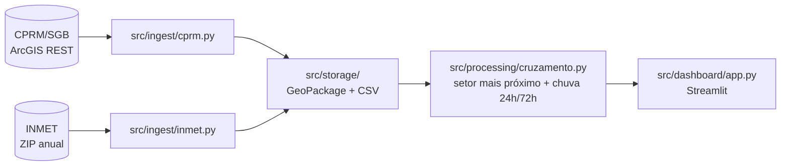
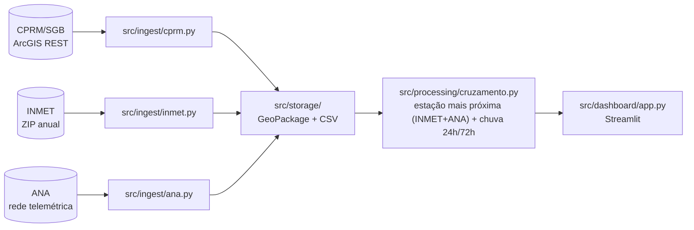

# Ingestão da ANA como fonte complementar de chuva Implementation Plan

> **For agentic workers:** REQUIRED SUB-SKILL: Use superpowers:subagent-driven-development (recommended) or superpowers:executing-plans to implement this plan task-by-task. Steps use checkbox (`- [ ]`) syntax for tracking.

**Goal:** Implementar `src/ingest/ana.py` (cliente da rede telemétrica da ANA), integrá-lo como fonte complementar de chuva ao INMET no cruzamento espacial, expor via CLI, mostrar no dashboard qual fonte foi usada por setor, e atualizar o README.

**Architecture:** Um novo módulo de ingestão (`src/ingest/ana.py`) segue o mesmo padrão de `src/ingest/inmet.py`/`src/ingest/cprm.py` e produz um DataFrame no **mesmo schema** usado pelo INMET (`data_hora, chuva_mm, codigo_estacao, nome_estacao, uf, latitude, longitude`), permitindo `pd.concat` direto sem adaptador. `src/processing/cruzamento.py` ganha uma função de pareamento combinado (INMET+ANA, distância manda, desempate por recência) usada opcionalmente por `calcular_cruzamento`. CLI, dashboard e README são atualizados para expor a nova fonte.

**Tech Stack:** Python 3.11+, `requests` (retry/backoff manual), `xml.etree.ElementTree` (parsing SOAP/XML da ANA), `pandas`/`geopandas` (dados e geoprocessamento), `pytest` + `responses` (testes com HTTP mockado).

## Global Constraints

- `EstacaoANA`, `fetch_estacoes`, `fetch_serie_estacao`, `ingerir_uf` seguem exatamente os nomes e a assinatura descritos no spec `docs/superpowers/specs/2026-08-09-ingestao-ana-design.md`.
- O DataFrame de saída de `ana.ingerir_uf` usa exatamente as colunas `data_hora, chuva_mm, codigo_estacao, nome_estacao, uf, latitude, longitude` — mesmo schema do INMET, sem adaptador.
- Filtro de qualidade: só entram no resultado estações com ao menos uma leitura de chuva não nula nas últimas `janela_horas` (padrão 48h).
- `encontrar_estacao_mais_proxima` (só INMET) não muda de assinatura nem de comportamento — regressão coberta pelos testes existentes de `tests/test_cruzamento.py`.
- Regra de prioridade no pareamento combinado: distância manda; desempate por recência de leitura só quando a diferença de distância entre a estação INMET e a ANA mais próximas de um setor é ≤ 500m.
- `calcular_cruzamento` aceita `chuva_ana: pd.DataFrame | None = None` como novo parâmetro; comportamento com `chuva_ana=None` é idêntico ao atual (regressão).
- Todo teste novo usa HTTP mockado (`responses`), sem depender de rede — mesmo padrão de `tests/test_inmet.py` e `tests/test_cprm.py`.
- CLI: `ingest-ana --uf` segue o padrão de `ingest-inmet`/`ingest-cprm`; `atualizar` tolera falha isolada da ANA sem derrubar CPRM/INMET (mesmo padrão try/except acumulando em `falhas`).

---

### Task 1: Cliente de ingestão `src/ingest/ana.py`

**Files:**
- Create: `src/ingest/ana.py`
- Modify: `src/config.py` (adicionar `caminho_chuva_ana`)
- Test: `tests/test_ana.py`

**Interfaces:**
- Produces: `ANAFetchError` (exceção), `EstacaoANA` (dataclass frozen: `codigo, nome, municipio_uf, latitude, longitude, status`), `fetch_estacoes(uf, timeout=60.0, session=None) -> list[EstacaoANA]`, `fetch_serie_estacao(codigo, dias_historico=4, timeout=20.0, session=None, max_retries=5, backoff_factor=1.5) -> pd.DataFrame` (colunas `data_hora, chuva_mm`), `ingerir_uf(uf, diretorio_dados, dias_historico=4, janela_horas=48, max_workers=5, timeout=20.0, max_retries=5, backoff_factor=1.5) -> pd.DataFrame` (colunas `data_hora, chuva_mm, codigo_estacao, nome_estacao, uf, latitude, longitude`), `caminho_chuva_ana(uf, data_dir=DATA_DIR) -> Path`. Usados por Task 3 (CLI) e Task 4 (dashboard).

- [ ] **Step 1: Adicionar `caminho_chuva_ana` em `src/config.py`**

Adicionar logo após `caminho_chuva` (depois da linha `return data_dir / f"chuva_{uf.lower()}_{ano}.csv"`):

```python
def caminho_chuva_ana(uf: str, data_dir: Path = DATA_DIR) -> Path:
    return data_dir / f"chuva_ana_{uf.lower()}.csv"
```

- [ ] **Step 2: Criar `src/ingest/ana.py`**

```python
"""Cliente de ingestão da rede telemétrica da ANA (Agência Nacional de Águas),
fonte complementar de chuva ao INMET.

Web service: https://telemetriaws1.ana.gov.br/ServiceANA.asmx — público, sem
captcha, sem autenticação. `ListaEstacoesTelemetricas` lista as estações de
uma UF; `DadosHidrometeorologicos` devolve leituras de chuva em intervalos de
15 minutos por estação.

O levantamento em scripts/investigar_ana.py (ver README) mostrou que nem toda
estação listada como "Ativo" transmite dado recente: de 437 estações
cadastradas em SP, 271 (62%) tinham leitura de chuva nas últimas 48h. A
maioria das estações com dado vivo são hidrelétricas/fluviométricas (nomes
como "UHE ... BARRAMENTO/JUSANTE"), não pluviômetros dedicados — o campo
`Chuva` existe e responde, mas a rede não foi desenhada como uma rede
pluviométrica dedicada. Essa é uma limitação conhecida da fonte, não um bug
desta ingestão: o filtro de qualidade abaixo (`janela_horas`) só garante que
a estação está *viva*, não que ela é um pluviômetro de referência.
"""

from __future__ import annotations

import logging
import time
import xml.etree.ElementTree as ET
from concurrent.futures import ThreadPoolExecutor, as_completed
from dataclasses import dataclass
from datetime import datetime, timedelta, timezone
from pathlib import Path

import pandas as pd
import requests

from src.config import caminho_chuva_ana
from src.storage import ler_chuva, salvar_chuva

logger = logging.getLogger(__name__)

BASE_URL = "https://telemetriaws1.ana.gov.br/ServiceANA.asmx"
LISTA_ESTACOES_URL = f"{BASE_URL}/ListaEstacoesTelemetricas"
DADOS_URL = f"{BASE_URL}/DadosHidrometeorologicos"


class ANAFetchError(RuntimeError):
    """Erro ao buscar dados da rede telemétrica da ANA."""


@dataclass(frozen=True)
class EstacaoANA:
    codigo: str
    nome: str
    municipio_uf: str
    latitude: float
    longitude: float
    status: str


def _parse_float(texto: str | None) -> float | None:
    if texto is None or texto.strip() == "":
        return None
    try:
        return float(texto.replace(",", "."))
    except ValueError:
        return None


def fetch_estacoes(
    uf: str,
    timeout: float = 60.0,
    session: requests.Session | None = None,
) -> list[EstacaoANA]:
    """Lista as estações telemétricas da ANA cadastradas numa UF."""
    sess = session or requests.Session()
    resp = sess.get(
        LISTA_ESTACOES_URL, params={"statusEstacoes": "", "origem": ""}, timeout=timeout
    )
    resp.raise_for_status()
    root = ET.fromstring(resp.content)

    sufixo = f"-{uf.upper()}"
    estacoes = []
    for tabela in root.iter():
        if not tabela.tag.endswith("Table"):
            continue
        municipio_uf = (tabela.findtext("Municipio-UF") or "").strip()
        if not municipio_uf.upper().endswith(sufixo):
            continue
        lat = _parse_float(tabela.findtext("Latitude"))
        lon = _parse_float(tabela.findtext("Longitude"))
        if lat is None or lon is None:
            continue
        estacoes.append(
            EstacaoANA(
                codigo=(tabela.findtext("CodEstacao") or "").strip(),
                nome=(tabela.findtext("NomeEstacao") or "").strip(),
                municipio_uf=municipio_uf,
                latitude=lat,
                longitude=lon,
                status=(tabela.findtext("StatusEstacao") or "").strip(),
            )
        )
    return estacoes


def fetch_serie_estacao(
    codigo: str,
    dias_historico: int = 4,
    timeout: float = 20.0,
    session: requests.Session | None = None,
    max_retries: int = 5,
    backoff_factor: float = 1.5,
) -> pd.DataFrame:
    """Busca a série de chuva de uma estação nos últimos `dias_historico` dias.

    Faz retry com backoff em erro de rede/HTTP (inclusive 429 Too Many
    Requests, que o serviço da ANA devolve com facilidade sob concorrência —
    lógica validada com requisições reais em scripts/investigar_ana.py) para
    não confundir "rate limit" com "estação sem dado".

    Retorna um DataFrame com colunas `data_hora` (UTC) e `chuva_mm`, ordenado
    por data. Vazio se a estação não tiver nenhuma leitura no período ou se
    todas as tentativas falharem.
    """
    sess = session or requests.Session()
    agora = datetime.now(timezone.utc)
    data_fim = agora.strftime("%d/%m/%Y")
    data_inicio = (agora - timedelta(days=dias_historico)).strftime("%d/%m/%Y")

    root = None
    for tentativa in range(1, max_retries + 1):
        try:
            resp = sess.get(
                DADOS_URL,
                params={"codEstacao": codigo, "dataInicio": data_inicio, "dataFim": data_fim},
                timeout=timeout,
            )
            resp.raise_for_status()
            root = ET.fromstring(resp.content)
            break
        except (requests.RequestException, ET.ParseError) as exc:
            espera = backoff_factor * (2 ** (tentativa - 1))
            if tentativa < max_retries:
                logger.debug(
                    "Falha ao consultar estação %s (tentativa %d/%d): %s. Aguardando %.1fs.",
                    codigo, tentativa, max_retries, exc, espera,
                )
                time.sleep(espera)
            else:
                logger.warning(
                    "Falha ao consultar estação %s após %d tentativas: %s",
                    codigo, max_retries, exc,
                )
                return pd.DataFrame(columns=["data_hora", "chuva_mm"])

    registros = []
    for linha in root.iter("DadosHidrometereologicos"):
        chuva = linha.findtext("Chuva")
        data_hora = linha.findtext("DataHora")
        if chuva is None or data_hora is None:
            continue
        try:
            ts = pd.to_datetime(data_hora.strip(), format="%Y-%m-%d %H:%M:%S", utc=True)
        except ValueError:
            continue
        chuva_mm = _parse_float(chuva)
        if chuva_mm is None:
            continue
        registros.append((ts, chuva_mm))

    df = pd.DataFrame(registros, columns=["data_hora", "chuva_mm"])
    return df.sort_values("data_hora").reset_index(drop=True)


def _tem_dado_recente(serie: pd.DataFrame, janela_horas: int) -> bool:
    if serie.empty:
        return False
    limite = datetime.now(timezone.utc) - timedelta(hours=janela_horas)
    return bool((serie["data_hora"] >= limite).any())


def ingerir_uf(
    uf: str,
    diretorio_dados: Path,
    dias_historico: int = 4,
    janela_horas: int = 48,
    max_workers: int = 5,
    timeout: float = 20.0,
    max_retries: int = 5,
    backoff_factor: float = 1.5,
) -> pd.DataFrame:
    """Busca a chuva das estações telemétricas da ANA com dado vivo numa UF e
    salva em CSV.

    Só mantém estações com ao menos uma leitura nas últimas `janela_horas`
    (ver docstring do módulo sobre a ressalva de cobertura da rede). Formato
    de saída igual ao do INMET (`data_hora, chuva_mm, codigo_estacao,
    nome_estacao, uf, latitude, longitude`), permitindo `pd.concat` direto
    entre as duas fontes sem adaptador.
    """
    uf_norm = uf.strip().upper()
    saida = caminho_chuva_ana(uf_norm, diretorio_dados)

    try:
        estacoes = fetch_estacoes(uf_norm, timeout=timeout)
    except requests.RequestException as exc:
        if saida.exists():
            logger.warning(
                "Fonte remota da ANA indisponível; usando cache local em %s", saida
            )
            return ler_chuva(saida)
        raise ANAFetchError(f"Não foi possível listar estações da ANA para {uf_norm}") from exc

    session = requests.Session()
    adapter = requests.adapters.HTTPAdapter(pool_connections=max_workers, pool_maxsize=max_workers)
    session.mount("https://", adapter)

    partes = []
    with ThreadPoolExecutor(max_workers=max_workers) as pool:
        futuros = {
            pool.submit(
                fetch_serie_estacao,
                e.codigo, dias_historico, timeout, session, max_retries, backoff_factor,
            ): e
            for e in estacoes
        }
        for futuro in as_completed(futuros):
            estacao = futuros[futuro]
            serie = futuro.result()
            if not _tem_dado_recente(serie, janela_horas):
                continue
            serie = serie.copy()
            serie["codigo_estacao"] = estacao.codigo
            serie["nome_estacao"] = estacao.nome
            serie["uf"] = uf_norm
            serie["latitude"] = estacao.latitude
            serie["longitude"] = estacao.longitude
            partes.append(serie)

    if not partes:
        raise ANAFetchError(f"Nenhuma estação da ANA com dado vivo encontrada para UF={uf_norm}")

    resultado = pd.concat(partes, ignore_index=True)
    salvar_chuva(resultado, saida)
    logger.info(
        "Salvas %d leituras de %d estações da ANA com dado vivo de %s em %s",
        len(resultado), len(partes), uf_norm, saida,
    )
    return resultado
```

- [ ] **Step 3: Criar `tests/test_ana.py`**

```python
from pathlib import Path

import pandas as pd
import pytest
import responses
from responses import matchers

from src.ingest.ana import (
    DADOS_URL,
    LISTA_ESTACOES_URL,
    ANAFetchError,
    _tem_dado_recente,
    fetch_estacoes,
    fetch_serie_estacao,
    ingerir_uf,
)

XML_ESTACOES_SP_E_RJ = """<?xml version="1.0" encoding="utf-8"?>
<DataTable>
  <Table>
    <CodEstacao>58040000</CodEstacao>
    <NomeEstacao>SAO LUIS DO PARAITINGA</NomeEstacao>
    <Municipio-UF>SAO LUIS DO PARAITINGA-SP</Municipio-UF>
    <Latitude>-23.35</Latitude>
    <Longitude>-45.25</Longitude>
    <StatusEstacao>Ativo</StatusEstacao>
  </Table>
  <Table>
    <CodEstacao>99999999</CodEstacao>
    <NomeEstacao>OUTRA CIDADE</NomeEstacao>
    <Municipio-UF>OUTRA CIDADE-RJ</Municipio-UF>
    <Latitude>-22.9</Latitude>
    <Longitude>-43.2</Longitude>
    <StatusEstacao>Ativo</StatusEstacao>
  </Table>
</DataTable>
""".encode("utf-8")


def _xml_dados(leituras: list[tuple[str, str]]) -> bytes:
    """leituras: lista de (data_hora, chuva) como strings, no formato do serviço."""
    linhas = "".join(
        f"<DadosHidrometereologicos><DataHora>{dh}</DataHora>"
        f"<Chuva>{chuva}</Chuva></DadosHidrometereologicos>"
        for dh, chuva in leituras
    )
    return f'<?xml version="1.0" encoding="utf-8"?><DataTable>{linhas}</DataTable>'.encode("utf-8")


@responses.activate
def test_fetch_estacoes_filtra_por_sufixo_de_uf():
    responses.add(responses.GET, LISTA_ESTACOES_URL, body=XML_ESTACOES_SP_E_RJ, status=200)

    estacoes = fetch_estacoes("SP")

    assert len(estacoes) == 1
    assert estacoes[0].codigo == "58040000"
    assert estacoes[0].municipio_uf == "SAO LUIS DO PARAITINGA-SP"


@responses.activate
def test_fetch_serie_estacao_parseia_leituras_ordenadas_por_data():
    xml = _xml_dados([("2026-08-09 10:15:00", "1.2"), ("2026-08-09 10:00:00", "0,6")])
    responses.add(responses.GET, DADOS_URL, body=xml, status=200)

    serie = fetch_serie_estacao("58040000", dias_historico=1)

    assert len(serie) == 2
    assert serie["data_hora"].is_monotonic_increasing
    assert serie["chuva_mm"].tolist() == [0.6, 1.2]


@responses.activate
def test_fetch_serie_estacao_retry_recupera_apos_429():
    responses.add(responses.GET, DADOS_URL, status=429)
    responses.add(
        responses.GET, DADOS_URL, body=_xml_dados([("2026-08-09 10:00:00", "2.0")]), status=200
    )

    serie = fetch_serie_estacao("58040000", dias_historico=1, max_retries=3, backoff_factor=0.01)

    assert len(serie) == 1
    assert serie["chuva_mm"].iloc[0] == 2.0


@responses.activate
def test_fetch_serie_estacao_falha_persistente_retorna_vazio():
    responses.add(responses.GET, DADOS_URL, status=500)

    serie = fetch_serie_estacao("58040000", dias_historico=1, max_retries=2, backoff_factor=0.01)

    assert serie.empty


def test_tem_dado_recente_verdadeiro_para_leitura_dentro_da_janela():
    agora = pd.Timestamp.now(tz="UTC")
    serie = pd.DataFrame({"data_hora": [agora - pd.Timedelta(hours=1)], "chuva_mm": [1.0]})

    assert _tem_dado_recente(serie, janela_horas=48) is True


def test_tem_dado_recente_falso_para_leitura_fora_da_janela_ou_serie_vazia():
    agora = pd.Timestamp.now(tz="UTC")
    serie_antiga = pd.DataFrame({"data_hora": [agora - pd.Timedelta(hours=100)], "chuva_mm": [1.0]})
    serie_vazia = pd.DataFrame(columns=["data_hora", "chuva_mm"])

    assert _tem_dado_recente(serie_antiga, janela_horas=48) is False
    assert _tem_dado_recente(serie_vazia, janela_horas=48) is False


@responses.activate
def test_ingerir_uf_mantem_so_estacoes_com_dado_vivo_e_usa_schema_do_inmet(tmp_path: Path):
    xml_estacoes = """<?xml version="1.0" encoding="utf-8"?>
<DataTable>
  <Table>
    <CodEstacao>VIVA01</CodEstacao>
    <NomeEstacao>ESTACAO VIVA</NomeEstacao>
    <Municipio-UF>CIDADE A-SP</Municipio-UF>
    <Latitude>-23.35</Latitude>
    <Longitude>-45.25</Longitude>
    <StatusEstacao>Ativo</StatusEstacao>
  </Table>
  <Table>
    <CodEstacao>MORTA01</CodEstacao>
    <NomeEstacao>ESTACAO SEM DADO RECENTE</NomeEstacao>
    <Municipio-UF>CIDADE B-SP</Municipio-UF>
    <Latitude>-23.40</Latitude>
    <Longitude>-45.30</Longitude>
    <StatusEstacao>Ativo</StatusEstacao>
  </Table>
</DataTable>
""".encode("utf-8")
    responses.add(responses.GET, LISTA_ESTACOES_URL, body=xml_estacoes, status=200)

    agora = pd.Timestamp.now(tz="UTC")
    leitura_recente = agora.strftime("%Y-%m-%d %H:%M:%S")
    leitura_antiga = (agora - pd.Timedelta(hours=200)).strftime("%Y-%m-%d %H:%M:%S")

    responses.add(
        responses.GET, DADOS_URL,
        body=_xml_dados([(leitura_recente, "3.0")]),
        status=200,
        match=[matchers.query_param_matcher({"codEstacao": "VIVA01"}, strict_match=False)],
    )
    responses.add(
        responses.GET, DADOS_URL,
        body=_xml_dados([(leitura_antiga, "1.0")]),
        status=200,
        match=[matchers.query_param_matcher({"codEstacao": "MORTA01"}, strict_match=False)],
    )

    resultado = ingerir_uf("SP", tmp_path, janela_horas=48, max_workers=1)

    assert set(resultado["codigo_estacao"]) == {"VIVA01"}
    assert list(resultado.columns) == [
        "data_hora", "chuva_mm", "codigo_estacao", "nome_estacao", "uf", "latitude", "longitude",
    ]
    assert (tmp_path / "chuva_ana_sp.csv").exists()


@responses.activate
def test_ingerir_uf_levanta_erro_se_nenhuma_estacao_tem_dado_vivo(tmp_path: Path):
    xml_estacoes = """<?xml version="1.0" encoding="utf-8"?>
<DataTable>
  <Table>
    <CodEstacao>MORTA01</CodEstacao>
    <NomeEstacao>ESTACAO SEM DADO RECENTE</NomeEstacao>
    <Municipio-UF>CIDADE B-SP</Municipio-UF>
    <Latitude>-23.40</Latitude>
    <Longitude>-45.30</Longitude>
    <StatusEstacao>Ativo</StatusEstacao>
  </Table>
</DataTable>
""".encode("utf-8")
    responses.add(responses.GET, LISTA_ESTACOES_URL, body=xml_estacoes, status=200)
    responses.add(responses.GET, DADOS_URL, body=_xml_dados([]), status=200)

    with pytest.raises(ANAFetchError):
        ingerir_uf("SP", tmp_path, janela_horas=48, max_workers=1)
```

- [ ] **Step 4: Rodar os testes novos**

Run: `pytest tests/test_ana.py -v`
Expected: 8 passed, 0 failed.

- [ ] **Step 5: Rodar a suíte completa para checar regressão**

Run: `pytest -q`
Expected: todos os testes existentes (22) + os 8 novos passam (30 no total), 0 falhas.

- [ ] **Step 6: Commit**

```bash
git add src/config.py src/ingest/ana.py tests/test_ana.py
git commit -m "feat(ingest): add ANA telemetry client as complementary rain source"
```

---

### Task 2: Cruzamento combinado INMET + ANA

**Files:**
- Modify: `src/processing/cruzamento.py`
- Test: `tests/test_cruzamento.py`

**Interfaces:**
- Consumes: DataFrame no schema `data_hora, chuva_mm, codigo_estacao, nome_estacao, uf, latitude, longitude` — mesmo formato produzido por `ana.ingerir_uf` (Task 1) e por `inmet.ingerir_uf` (já existente).
- Produces: `encontrar_estacao_mais_proxima_combinada(setores, chuva_inmet, chuva_ana, limiar_empate_m=500.0) -> gpd.GeoDataFrame` (mesmas colunas de `encontrar_estacao_mais_proxima` + `fonte_estacao`); `calcular_cruzamento(setores, chuva_df, chuva_ana=None, referencia=None, janelas=JANELAS_PADRAO)` — assinatura estendida, `chuva_ana` como 3º parâmetro posicional opcional. Usado por Task 4 (dashboard).

- [ ] **Step 1: Adicionar `encontrar_estacao_mais_proxima_combinada` em `src/processing/cruzamento.py`**

Inserir logo depois da função `encontrar_estacao_mais_proxima` existente (que não muda):

```python
def encontrar_estacao_mais_proxima_combinada(
    setores: gpd.GeoDataFrame,
    chuva_inmet: pd.DataFrame,
    chuva_ana: pd.DataFrame | None,
    limiar_empate_m: float = 500.0,
) -> gpd.GeoDataFrame:
    """Para cada setor, acha a estação mais próxima entre INMET e ANA combinadas.

    Regra de prioridade (ver
    docs/superpowers/specs/2026-08-09-ingestao-ana-design.md): a distância
    manda — a estação mais próxima do centróide do setor vence, seja ela
    INMET ou ANA. O desempate por recência de leitura só entra em jogo
    quando as duas fontes têm uma estação a uma distância praticamente igual
    (diferença menor que `limiar_empate_m`, padrão 500m); nesse caso a
    estação com leitura mais recente vence. Na prática isso quase sempre
    favorece a ANA (granularidade de 15min) sobre o INMET (defasagem de
    dias) nesses empates — mas a regra não é hardcoded para nenhuma fonte
    específica, só para a leitura mais recente.
    """
    if chuva_ana is None or chuva_ana.empty:
        resultado = encontrar_estacao_mais_proxima(setores, chuva_inmet)
        resultado["fonte_estacao"] = "inmet"
        return resultado

    inmet_pareado = encontrar_estacao_mais_proxima(setores, chuva_inmet)
    ana_pareado = encontrar_estacao_mais_proxima(setores, chuva_ana)

    ultima_leitura_inmet = chuva_inmet.groupby("codigo_estacao")["data_hora"].max()
    ultima_leitura_ana = chuva_ana.groupby("codigo_estacao")["data_hora"].max()
    epoca = pd.Timestamp.min.tz_localize("UTC")

    codigos, nomes, distancias, fontes = [], [], [], []
    for i in range(len(setores)):
        dist_inmet = inmet_pareado["distancia_km"].iloc[i]
        dist_ana = ana_pareado["distancia_km"].iloc[i]

        if pd.isna(dist_ana):
            vencedor, fonte = inmet_pareado, "inmet"
        elif pd.isna(dist_inmet):
            vencedor, fonte = ana_pareado, "ana"
        elif abs(dist_inmet - dist_ana) * 1000 <= limiar_empate_m:
            cod_inmet = inmet_pareado["codigo_estacao"].iloc[i]
            cod_ana = ana_pareado["codigo_estacao"].iloc[i]
            leitura_inmet = ultima_leitura_inmet.get(cod_inmet, epoca)
            leitura_ana = ultima_leitura_ana.get(cod_ana, epoca)
            if leitura_ana >= leitura_inmet:
                vencedor, fonte = ana_pareado, "ana"
            else:
                vencedor, fonte = inmet_pareado, "inmet"
        elif dist_inmet < dist_ana:
            vencedor, fonte = inmet_pareado, "inmet"
        else:
            vencedor, fonte = ana_pareado, "ana"

        codigos.append(vencedor["codigo_estacao"].iloc[i])
        nomes.append(vencedor["nome_estacao"].iloc[i])
        distancias.append(vencedor["distancia_km"].iloc[i])
        fontes.append(fonte)

    resultado = setores.copy()
    resultado["codigo_estacao"] = codigos
    resultado["nome_estacao"] = nomes
    resultado["distancia_km"] = distancias
    resultado["fonte_estacao"] = fontes
    return resultado
```

- [ ] **Step 2: Atualizar `calcular_cruzamento` para aceitar `chuva_ana`**

Substituir a assinatura e o corpo atual de `calcular_cruzamento`:

```python
def calcular_cruzamento(
    setores: gpd.GeoDataFrame,
    chuva_df: pd.DataFrame,
    chuva_ana: pd.DataFrame | None = None,
    referencia: pd.Timestamp | None = None,
    janelas: tuple[int, ...] = JANELAS_PADRAO,
) -> gpd.GeoDataFrame:
    """Cruza setores de risco com chuva: acha a estação mais próxima de cada setor
    (combinando INMET e, se fornecida, a ANA como fonte complementar — ver
    `encontrar_estacao_mais_proxima_combinada`) e calcula a chuva acumulada nas
    janelas de tempo pedidas (em horas), terminando na leitura mais recente
    disponível na série (`referencia`).
    """
    if chuva_df.empty:
        raise ValueError("chuva_df está vazio; nada para cruzar.")

    ref = referencia or chuva_df["data_hora"].max()

    resultado = encontrar_estacao_mais_proxima_combinada(setores, chuva_df, chuva_ana)

    chuva_combinada = (
        chuva_df if chuva_ana is None or chuva_ana.empty
        else pd.concat([chuva_df, chuva_ana], ignore_index=True)
    )
    series_por_estacao = {
        codigo: grupo[["data_hora", "chuva_mm"]]
        for codigo, grupo in chuva_combinada.groupby("codigo_estacao")
    }

    for horas in janelas:
        coluna = f"chuva_{horas}h"
        resultado[coluna] = [
            _chuva_acumulada(series_por_estacao[codigo], ref, horas)
            if codigo in series_por_estacao
            else float("nan")
            for codigo in resultado["codigo_estacao"]
        ]

    resultado.attrs["referencia"] = ref
    return resultado
```

- [ ] **Step 3: Adicionar os testes novos em `tests/test_cruzamento.py`**

Atualizar o import no topo do arquivo:

```python
from src.processing.cruzamento import (
    calcular_cruzamento,
    encontrar_estacao_mais_proxima,
    encontrar_estacao_mais_proxima_combinada,
    sinalizar_atencao,
)
```

Adicionar ao final do arquivo:

```python
def test_combinada_ana_mais_proxima_vence(setores):
    chuva_inmet = _serie_horaria("A701", -23.55, -46.65, "INMET LONGE DE S1", {0: 1.0}, "2026-07-31 00:00")
    chuva_ana = _serie_horaria("ANA01", -23.5005, -46.6005, "ANA PERTO DE S1", {0: 5.0}, "2026-07-31 00:00")

    resultado = encontrar_estacao_mais_proxima_combinada(setores, chuva_inmet, chuva_ana)

    s1 = resultado[resultado["num_setor"] == "S1"].iloc[0]
    assert s1["fonte_estacao"] == "ana"
    assert s1["codigo_estacao"] == "ANA01"


def test_combinada_inmet_mais_proxima_vence(setores):
    chuva_inmet = _serie_horaria("A701", -23.5005, -46.6005, "INMET PERTO DE S1", {0: 1.0}, "2026-07-31 00:00")
    chuva_ana = _serie_horaria("ANA01", -23.55, -46.65, "ANA LONGE DE S1", {0: 5.0}, "2026-07-31 00:00")

    resultado = encontrar_estacao_mais_proxima_combinada(setores, chuva_inmet, chuva_ana)

    s1 = resultado[resultado["num_setor"] == "S1"].iloc[0]
    assert s1["fonte_estacao"] == "inmet"
    assert s1["codigo_estacao"] == "A701"


def test_combinada_desempate_por_recencia_favorece_leitura_mais_nova(setores):
    mesma_lat, mesma_lon = -23.5005, -46.6005
    chuva_inmet = _serie_horaria(
        "A701", mesma_lat, mesma_lon, "INMET EMPATADO MAIS ANTIGO", {0: 1.0}, "2026-07-25 00:00"
    )
    chuva_ana = _serie_horaria(
        "ANA01", mesma_lat, mesma_lon, "ANA EMPATADO MAIS NOVO", {0: 1.0}, "2026-07-31 00:00"
    )

    resultado = encontrar_estacao_mais_proxima_combinada(setores, chuva_inmet, chuva_ana)

    s1 = resultado[resultado["num_setor"] == "S1"].iloc[0]
    assert s1["fonte_estacao"] == "ana"


def test_combinada_desempate_por_recencia_pode_favorecer_inmet(setores):
    mesma_lat, mesma_lon = -23.5005, -46.6005
    chuva_inmet = _serie_horaria(
        "A701", mesma_lat, mesma_lon, "INMET EMPATADO MAIS NOVO", {0: 1.0}, "2026-07-31 00:00"
    )
    chuva_ana = _serie_horaria(
        "ANA01", mesma_lat, mesma_lon, "ANA EMPATADO MAIS ANTIGO", {0: 1.0}, "2026-07-25 00:00"
    )

    resultado = encontrar_estacao_mais_proxima_combinada(setores, chuva_inmet, chuva_ana)

    s1 = resultado[resultado["num_setor"] == "S1"].iloc[0]
    assert s1["fonte_estacao"] == "inmet"


def test_calcular_cruzamento_sem_chuva_ana_mantem_comportamento_atual(setores, chuva_df):
    referencia = pd.Timestamp("2026-07-31 07:00", tz="UTC")

    resultado = calcular_cruzamento(setores, chuva_df, referencia=referencia, janelas=(24, 72))

    assert (resultado["fonte_estacao"] == "inmet").all()
    s1 = resultado[resultado["num_setor"] == "S1"].iloc[0]
    assert s1["chuva_24h"] == pytest.approx(24.0)


def test_calcular_cruzamento_usa_chuva_da_ana_quando_ela_vence(setores):
    referencia = pd.Timestamp("2026-07-31 07:00", tz="UTC")
    chuva_inmet = _serie_horaria(
        "A701", -23.55, -46.65, "INMET LONGE", {i: 1.0 for i in range(80)}, "2026-07-28 00:00"
    )
    chuva_ana = _serie_horaria(
        "ANA01", -23.5005, -46.6005, "ANA PERTO", {i: 2.0 for i in range(80)}, "2026-07-28 00:00"
    )

    resultado = calcular_cruzamento(
        setores, chuva_inmet, chuva_ana=chuva_ana, referencia=referencia, janelas=(24,)
    )

    s1 = resultado[resultado["num_setor"] == "S1"].iloc[0]
    assert s1["fonte_estacao"] == "ana"
    assert s1["codigo_estacao"] == "ANA01"
    assert s1["chuva_24h"] == pytest.approx(48.0)
```

- [ ] **Step 4: Rodar os testes novos**

Run: `pytest tests/test_cruzamento.py -v`
Expected: 12 passed (6 testes existentes + 6 novos), 0 falhas.

- [ ] **Step 5: Rodar a suíte completa para checar regressão**

Run: `pytest -q`
Expected: 36 passed (30 do Task 1 + 6 novos deste task), 0 falhas.

- [ ] **Step 6: Commit**

```bash
git add src/processing/cruzamento.py tests/test_cruzamento.py
git commit -m "feat(cruzamento): combine INMET and ANA stations with distance/recency rule"
```

---

### Task 3: CLI — `ingest-ana` e `atualizar`

**Files:**
- Modify: `src/cli.py`

**Interfaces:**
- Consumes: `ANAFetchError`, `ingerir_uf` de `src.ingest.ana` (Task 1).

- [ ] **Step 1: Adicionar o import no topo de `src/cli.py`**

Depois de `from src.ingest.inmet import INMETFetchError, ingerir_uf as ingerir_inmet`:

```python
from src.ingest.ana import ANAFetchError, ingerir_uf as ingerir_ana
```

- [ ] **Step 2: Adicionar o comando `ingest-ana`**

Inserir depois do comando `ingest_inmet` (antes de `@app.command()` / `def atualizar`):

```python
@app.command("ingest-ana")
def ingest_ana(
    uf: str = typer.Option(..., "--uf", help="Sigla da UF, ex.: SP"),
    diretorio: Path = typer.Option(DATA_DIR, "--diretorio", help="Diretório de dados local"),
    janela_horas: int = typer.Option(
        48, help="Janela de recência (h) para considerar uma estação com dado vivo"
    ),
    max_workers: int = typer.Option(5, help="Requisições em paralelo"),
) -> None:
    """Baixa chuva das estações telemétricas da ANA com dado vivo para uma UF."""
    df = ingerir_ana(uf, diretorio, janela_horas=janela_horas, max_workers=max_workers)
    typer.echo(f"{len(df)} leituras da ANA salvas em {diretorio}/chuva_ana_{uf.lower()}.csv")
```

- [ ] **Step 3: Adicionar a etapa da ANA em `atualizar`**

Dentro de `def atualizar(...)`, depois do bloco try/except do INMET e antes de `marcador = DATA_DIR / "ultima_atualizacao.txt"`:

```python
    typer.echo(f"[{datetime.now(timezone.utc).isoformat()}] Atualizando chuva da ANA ({uf_norm})...")
    try:
        chuva_ana = ingerir_ana(uf_norm, DATA_DIR)
        typer.echo(f"  {len(chuva_ana)} leituras da ANA salvas.")
    except (ANAFetchError, ValueError) as exc:
        typer.echo(f"  FALHA na ANA: {exc}", err=True)
        falhas.append("ana")
```

- [ ] **Step 4: Verificar que a CLI carrega sem erro e lista o novo comando**

Run: `python -m src.cli --help`
Expected: saída lista `ingest-ana` entre os comandos disponíveis, sem traceback.

Run: `python -m src.cli ingest-ana --help`
Expected: mostra as opções `--uf`, `--diretorio`, `--janela-horas`, `--max-workers`, sem traceback.

- [ ] **Step 5: Rodar a suíte completa para checar regressão**

Run: `pytest -q`
Expected: 36 passed, 0 falhas (CLI não tem testes dedicados no projeto — mesmo padrão de `ingest-cprm`/`ingest-inmet` — a verificação é manual via `--help`).

- [ ] **Step 6: Commit**

```bash
git add src/cli.py
git commit -m "feat(cli): add ingest-ana command and wire it into atualizar"
```

---

### Task 4: Dashboard — indicar fonte da estação (INMET/ANA)

**Files:**
- Modify: `src/dashboard/app.py`

**Interfaces:**
- Consumes: `caminho_chuva_ana` (Task 1), `calcular_cruzamento(..., chuva_ana=...)` (Task 2).

- [ ] **Step 1: Atualizar o import de `src.config` (linhas 19-25 do arquivo atual)**

Trocar:

```python
from src.config import (
    DATA_DIR,
    LIMIAR_ATENCAO_MM_PADRAO,
    UFS_DISPONIVEIS,
    caminho_chuva,
    caminho_setores,
)
```

Por:

```python
from src.config import (
    DATA_DIR,
    LIMIAR_ATENCAO_MM_PADRAO,
    UFS_DISPONIVEIS,
    caminho_chuva,
    caminho_chuva_ana,
    caminho_setores,
)
```

- [ ] **Step 2: Adicionar `_carregar_chuva_ana` depois de `_carregar_chuva`**

Logo após a função `_carregar_chuva` existente (que não muda), adicionar:

```python
@st.cache_data(show_spinner=False)
def _carregar_chuva_ana(uf: str) -> pd.DataFrame | None:
    """Carrega a chuva da ANA se já existir localmente. Não baixa automaticamente
    — a ANA é uma fonte complementar opcional, sem download obrigatório no
    primeiro carregamento do dashboard (ver src/ingest/ana.py)."""
    caminho = caminho_chuva_ana(uf, DATA_DIR)
    if not chuva_existe(caminho):
        return None
    return ler_chuva(caminho)
```

- [ ] **Step 3: Carregar `chuva_ana` em `main()` e mostrar na barra lateral**

Trocar o bloco:

```python
    with st.spinner("Carregando dados locais..."):
        setores = _carregar_setores(uf)
        chuva = _carregar_chuva(uf, ano)
```

Por:

```python
    with st.spinner("Carregando dados locais..."):
        setores = _carregar_setores(uf)
        chuva = _carregar_chuva(uf, ano)
        chuva_ana = _carregar_chuva_ana(uf)

    if chuva_ana is not None:
        st.sidebar.caption(
            f"Chuva complementar da ANA carregada: "
            f"{chuva_ana['codigo_estacao'].nunique()} estações com dado vivo."
        )
    else:
        st.sidebar.caption(
            "Chuva da ANA não carregada localmente — rode "
            "`python -m src.cli ingest-ana --uf " + uf + "` para habilitá-la "
            "como fonte complementar de chuva."
        )
```

- [ ] **Step 4: Passar `chuva_ana` para `calcular_cruzamento`**

Trocar:

```python
    cruzado = calcular_cruzamento(setores_filtrados, chuva, janelas=(24, 72))
```

Por:

```python
    cruzado = calcular_cruzamento(setores_filtrados, chuva, chuva_ana=chuva_ana, janelas=(24, 72))
```

- [ ] **Step 5: Adicionar `fonte_estacao` ao tooltip do mapa**

Dentro de `_construir_mapa`, trocar:

```python
    campos = ["munic", "num_setor", "grau_risco", "distancia_km", "chuva_24h", "chuva_72h"]
    aliases = [
        "Município:", "Setor:", "Grau de risco:", "Estação a (km):",
        "Chuva 24h (mm):", "Chuva 72h (mm):",
    ]
```

Por:

```python
    campos = [
        "munic", "num_setor", "grau_risco", "distancia_km",
        "chuva_24h", "chuva_72h", "fonte_estacao",
    ]
    aliases = [
        "Município:", "Setor:", "Grau de risco:", "Estação a (km):",
        "Chuva 24h (mm):", "Chuva 72h (mm):", "Fonte da estação:",
    ]
```

(O restante da função, incluindo o filtro `campos = [c for c in campos if c in exibicao.columns]`, já trata a ausência da coluna com segurança — nenhuma outra mudança necessária ali.)

- [ ] **Step 6: Adicionar `fonte_estacao` à tabela de "setores em atenção"**

Trocar:

```python
            st.dataframe(
                em_atencao[["munic", "num_setor", "grau_risco", f"chuva_{janela}h", "distancia_km"]]
                .rename(columns={
                    "munic": "Município", "num_setor": "Setor", "grau_risco": "Grau de risco",
                    f"chuva_{janela}h": f"Chuva {janela}h (mm)", "distancia_km": "Estação a (km)",
                })
                .reset_index(drop=True),
                use_container_width=True,
            )
```

Por:

```python
            st.dataframe(
                em_atencao[
                    ["munic", "num_setor", "grau_risco", f"chuva_{janela}h", "distancia_km", "fonte_estacao"]
                ]
                .rename(columns={
                    "munic": "Município", "num_setor": "Setor", "grau_risco": "Grau de risco",
                    f"chuva_{janela}h": f"Chuva {janela}h (mm)", "distancia_km": "Estação a (km)",
                    "fonte_estacao": "Fonte",
                })
                .reset_index(drop=True),
                use_container_width=True,
            )
```

- [ ] **Step 7: Rodar a suíte completa para checar regressão**

Run: `pytest -q`
Expected: 36 passed, 0 falhas (`tests/test_dashboard.py` testa `_cor_por_grau` e `_construir_mapa` com um GeoDataFrame que não tem `fonte_estacao` — o filtro `campos = [c for c in campos if c in exibicao.columns]` já existente cobre esse caso sem quebrar).

- [ ] **Step 8: Smoke test manual do dashboard (opcional, requer dados locais)**

Se houver dados locais de teste disponíveis (`data/risco_sp.gpkg`, `data/chuva_sp_2026.csv`), rodar `streamlit run src/dashboard/app.py` e conferir visualmente que a barra lateral mostra a mensagem sobre a ANA e que o app não quebra com `chuva_ana=None`. Pular esse step se não houver dados locais — não é uma condição de bloqueio, é apenas confirmação visual extra.

- [ ] **Step 9: Commit**

```bash
git add src/dashboard/app.py
git commit -m "feat(dashboard): show ANA vs INMET as the station source per setor"
```

---

### Task 5: Atualizar README

**Files:**
- Modify: `README.md`

**Interfaces:**
- Nenhuma — só texto.

- [ ] **Step 1: Mover a ANA para a tabela "Fontes de dados"**

Trocar a tabela em `## Fontes de dados`:

```markdown
| Fonte | O que fornece | Endpoint confirmado em 05/08/2026 |
|---|---|---|
| **CPRM/SGB** | Polígonos de setorização de risco geológico (grau de risco, tipologia, nº de moradias/pessoas afetadas) | `https://geoportal.sgb.gov.br/server/rest/services/gestaoterritorial/risco/FeatureServer/0` (ArcGIS REST, GeoJSON) |
| **INMET** | Chuva horária por estação meteorológica automática | `https://portal.inmet.gov.br/uploads/dadoshistoricos/{ano}.zip` (CSV, pacote público anual) |
```

Por:

```markdown
| Fonte | O que fornece | Endpoint confirmado em 05/08/2026 |
|---|---|---|
| **CPRM/SGB** | Polígonos de setorização de risco geológico (grau de risco, tipologia, nº de moradias/pessoas afetadas) | `https://geoportal.sgb.gov.br/server/rest/services/gestaoterritorial/risco/FeatureServer/0` (ArcGIS REST, GeoJSON) |
| **INMET** | Chuva horária por estação meteorológica automática | `https://portal.inmet.gov.br/uploads/dadoshistoricos/{ano}.zip` (CSV, pacote público anual) |
| **ANA** | Chuva em intervalos de 15min por estação telemétrica (fonte complementar ao INMET; nem toda estação tem dado vivo — ver [Decisões e investigações](#decisões-e-investigações)) | `https://telemetriaws1.ana.gov.br/ServiceANA.asmx` (SOAP/XML, sem captcha/autenticação) |
```

- [ ] **Step 2: Atualizar o diagrama de Arquitetura**

Trocar o bloco Mermaid:



Por:



- [ ] **Step 3: Atualizar "Testes e CI"**

Trocar:

```markdown
22 testes cobrindo: parsing de resposta ArcGIS REST (CPRM/SGB), paginação,
retry com backoff e fallback para cache local; parsing do CSV do INMET e
leitura de estação dentro do ZIP anual; a lógica de cruzamento espacial
(estação mais próxima) e temporal (chuva acumulada 24h/72h); e as funções
auxiliares do dashboard. Toda chamada de rede é mockada, então a suíte roda
sem internet.
```

Por:

```markdown
36 testes cobrindo: parsing de resposta ArcGIS REST (CPRM/SGB), paginação,
retry com backoff e fallback para cache local; parsing do CSV do INMET e
leitura de estação dentro do ZIP anual; parsing do XML/SOAP da ANA, retry em
HTTP 429 e o filtro de estações sem dado recente; a lógica de cruzamento
espacial (estação mais próxima, incluindo o pareamento combinado INMET+ANA
com desempate por recência) e temporal (chuva acumulada 24h/72h); e as
funções auxiliares do dashboard. Toda chamada de rede é mockada, então a
suíte roda sem internet.
```

- [ ] **Step 4: Atualizar a seção "Decisões e investigações"**

Trocar o parágrafo da ANA:

```markdown
**Investigação da ANA.** A rede telemétrica da ANA foi avaliada como fonte
complementar de chuva em tempo real: das 437 estações listadas para SP, 271
(62%) têm dado vivo, com distância mediana de 18,6km até o setor de risco
mais próximo — cobertura mais densa que o INMET. Ressalva: as estações com
dado vivo são majoritariamente hidrelétricas/fluviométricas, não pluviômetros
dedicados. →
[detalhes completos](docs/investigacoes.md#investigação-fontes-de-chuva-em-tempo-real)
```

Por:

```markdown
**Investigação da ANA → integração feita.** A rede telemétrica da ANA foi
avaliada como fonte complementar de chuva em tempo real: das 437 estações
listadas para SP, 271 (62%) têm dado vivo, com distância mediana de 18,6km
até o setor de risco mais próximo — cobertura mais densa que o INMET.
Ressalva: as estações com dado vivo são majoritariamente
hidrelétricas/fluviométricas, não pluviômetros dedicados. A integração foi
implementada em `src/ingest/ana.py`: o cruzamento (`calcular_cruzamento`)
agora usa a estação mais próxima entre INMET e ANA combinadas — distância
manda, com desempate por recência de leitura quando as duas fontes têm uma
estação a menos de 500m de diferença de distância. →
[detalhes completos](docs/investigacoes.md#investigação-fontes-de-chuva-em-tempo-real)
```

- [ ] **Step 5: Atualizar o Roadmap**

Trocar:

```markdown
- ~~Levantar quais estações da rede telemétrica da ANA têm dado vivo de chuva
  em SP~~ — feito em 08/08/2026: 62% de cobertura, distância mediana de
  18,6km até o setor de risco mais próximo (ver
  [Decisões e investigações](#decisões-e-investigações)). Próximo passo:
  implementar `src/ingest/ana.py` e integrar como fonte complementar ao
  INMET no cruzamento (`src/processing/cruzamento.py`).
```

Por:

```markdown
- ~~Levantar quais estações da rede telemétrica da ANA têm dado vivo de chuva
  em SP e integrar como fonte complementar ao INMET~~ — levantamento feito em
  08/08/2026, integração (`src/ingest/ana.py` + cruzamento combinado)
  implementada em 09/08/2026 (ver
  [Decisões e investigações](#decisões-e-investigações)).
```

- [ ] **Step 6: Verificar que os checks de header ainda passam**

Run:
```bash
for h in "## Fontes de dados" "## Arquitetura" "## Decisões e investigações" "## Roadmap"; do
  grep -qF "$h" README.md && echo "OK: $h" || echo "FALTANDO: $h"
done
grep -c '```mermaid' README.md
```
Expected: todas `OK: ...`, e a contagem de blocos Mermaid é `1`.

- [ ] **Step 7: Commit**

```bash
git add README.md
git commit -m "docs: document ANA integration in Fontes de dados, Arquitetura and Roadmap"
```

---

## Self-Review Notes

- **Spec coverage:** todos os itens do spec (`docs/superpowers/specs/2026-08-09-ingestao-ana-design.md`) têm task correspondente — cliente ANA (Task 1), cruzamento combinado (Task 2), CLI (Task 3), dashboard (Task 4), README (Task 5).
- **Placeholder scan:** nenhum "TBD"/"TODO" — todo código e conteúdo de README está escrito por extenso.
- **Consistência de tipos/assinaturas:** `EstacaoANA`, `fetch_estacoes`, `fetch_serie_estacao`, `ingerir_uf`, `ANAFetchError` usados identicamente em Task 1 (definição), Task 3 (CLI) e Task 4 (dashboard usa só `caminho_chuva_ana`, não usa `ingerir_uf` diretamente — download manual via CLI, coerente com "sem download automático" do spec). `encontrar_estacao_mais_proxima_combinada` e o novo parâmetro `chuva_ana` de `calcular_cruzamento` são usados de forma consistente entre Task 2 (definição) e Task 4 (dashboard).
